# Statistical Word Segmentation as Emergent Structure in a Next-Character RNN

**Working title** · Manuscript draft · All reported models use hidden size \(h = 50\)

---

## Abstract

Eight-month-old infants can segment continuous speech by tracking transitional probabilities between syllables (Saffran, Aslin, & Newport, 1996). A long-standing computational question is what kind of learner, given only local prediction and no explicit boundary labels, would discover comparable structure. Here we study a deliberately minimal answer: a vanilla Elman recurrent neural network trained to predict the next character in an unsegmented artificial language. The training objective never mentions words, spaces, or boundaries. Nonetheless, after learning, the network generates almost exclusively legal vocabulary items, and its hidden states become a continuous embedding of the vocabulary’s minimal deterministic finite automaton (DFA)—the equivalence classes of in-word prefixes that share identical futures.

We develop this claim in three stages. First, we present a single-task deep dive on a 16-word, fixed 4-letter lexicon (the *anchor* condition). On this task, multivariate \(\eta^2\) for DFA state reaches approximately 0.95 on condensed hidden states; linear readout recovers DFA identity from the top three principal components at chance-corrected accuracy \(\geq 0.95\); and population unit selectivity is dominated by DFA and prefix features rather than raw character identity. Second, we show that this solution is realizable across six independent training seeds: decoding saturation order (position and DFA before character) is stable, while closed-loop trajectory geometry varies in detail. Third, we compare 3-, 4-, 5-letter and mixed 3–5 letter vocabularies at matched word count. Fixed-length streams preserve the strongest DFA geometry; mixed-length streams elevate the relative contribution of character identity, consistent with a shift in what information is most useful for prediction when word length is no longer a reliable cue.

Analyses of the learned weights complement the representational results. Relative to random initialization, training roughly doubles the input-to-recurrent Frobenius ratio and raises mean per-unit input-drive fraction from 0.50 to 0.71, while hierarchical clustering of \(W_{hh}\) and \(W_{xh}\) reveals block coupling and letter-tuned columns. We argue that statistical word segmentation, in this setting, is not a separate module but the internal geometry of successful next-character prediction on a finite lexicon.

---

## 1. Introduction

### 1.1 Statistical learning and the segmentation problem

Fluent speech and many artificial laboratory languages arrive as continuous streams. Listeners must discover where one word ends and the next begins without consistent pauses. Classic infant experiments demonstrated that transitional probabilities between adjacent syllables are sufficient for this discovery: within-word transitions are typically more predictable than across-word transitions, and 8-month-olds exploit that contingency after brief exposure (Saffran et al., 1996; Aslin, Saffran, & Newport, 1998). Parallel work in adults and computational modeling has explored Bayesian segmentation, chunking, and predictive coding accounts of the same phenomenon (e.g., Goldwater, Griffiths, & Johnson, 2009; Frank, Goldwater, Griffiths, & Tenenbaum, 2010; Perruchet & Vinter, 1998).

What remains less settled is the *mechanistic* form of the learner. Does segmentation require an explicit boundary detector, a dedicated chunk store, or can it fall out of a generic sequence model whose only job is to predict what comes next? The present paper takes the latter possibility seriously and tests it in a setting where the “correct” internal structure is known exactly.

### 1.2 Prediction, memory, and finite automata

Consider a finite vocabulary \(V\) over an alphabet \(\Sigma\), and a training stream formed by concatenating draws from \(V\) with no separators. At time \(t\) the learner observes character \(x_t \in \Sigma\) and must predict \(x_{t+1}\). Optimal prediction depends on the set of vocabulary words still consistent with the characters read since the last word boundary. That set is precisely the state of the vocabulary’s *prefix trie*, and after merging states with identical futures, the state of its *minimal DFA* (Hopcroft, Motwani, & Ullman, 2006). Two prefixes that lead to the same DFA state license the same distribution over next characters; prefixes that lead to different states generally do not.

An Elman recurrent network (Elman, 1990) maintains a continuous hidden state \(\mathbf{h}_t \in \mathbb{R}^H\) updated by
\[
\mathbf{h}_t = \tanh\!\bigl(W_{xh}\, \mathbf{x}_t + W_{hh}\, \mathbf{h}_{t-1} + \mathbf{b}_h\bigr),
\]
with next-character logits \(W_{hy}\mathbf{h}_t + \mathbf{b}_y\). Nothing in this architecture names “words.” Yet if training succeeds, \(\mathbf{h}_t\) must carry at least the information in the DFA state—otherwise the readout cannot implement the correct conditional distribution. The empirical question is whether that information is merely latent and entangled, or whether it becomes *geometrically organized* in a way that can be recovered by linear probes, population metrics, and single-unit analyses.

### 1.3 Related computational work

Elman’s original simple recurrent networks already suggested that hidden units can track grammatical categories and word boundaries in toy languages (Elman, 1990, 1991). Subsequent connectionist models of segmentation include TRACX and related chunking architectures (French, Addyman, & Mareschal, 2011), PARSER (Perruchet & Vinter, 1998), and modern neural language models evaluated on statistical-learning batteries (e.g., Alhama & Zuidema, 2019). Parallel lines of work in dynamical systems and neuroscience ask how recurrent networks embed discrete automata and cognitive maps in continuous state spaces (Sussillo & Barak, 2013; Mante, Sussillo, Shenoy, & Newsome, 2013; Maheswaranathan, Williams, Golub, Mel, & Sussillo, 2019).

Our contribution is narrower and more diagnostic. We fix a small, fully known lexicon; compile its minimal DFA as ground truth; train a standard next-character RNN with no boundary loss; and ask, with a battery of geometric and decoding analyses, whether \(\mathbf{h}_t\) implements that automaton. We then vary word length and length mixing to see when DFA geometry strengthens or yields to character-centric codes.

### 1.4 Overview of the present study

The paper is organized as a *single-task walkthrough* followed by *bounded comparisons*, rather than a large factorial sweep.

1. **Anchor deep dive.** Sixteen fixed 4-letter words, unsegmented stream, \(H = 50\). We show learning curves, weight structure, activation geometry, feature separation, linear decoding, and unit selectivity.
2. **Realizability.** The same analyses across six seeds \(\{1,2,3,5,7,8\}\) for decoding and closed-loop trajectories.
3. **Length comparison.** Matched 16-word vocabularies with lengths 3, 4, 5, and mixed 3–5, using seeds \(\{1,2,3\}\).

We intentionally restrict capacity (\(H = 50\)) and vocabulary size (at most 16 words in the comparisons reported here) so that figures remain inspectable and claims remain tied to a concrete automaton rather than an opaque large model.

---

## 2. Methods

### 2.1 Artificial languages

Each experiment uses a fixed vocabulary \(V = \{w_1,\ldots,w_n\}\) of English-like letter strings. A corpus of \(T = 50{,}000\) characters is generated by repeatedly sampling a word uniformly from \(V\) and appending its characters, with **no spaces or other boundary markers**. Different random seeds produce different concatenations of the same vocabulary.

The **anchor** vocabulary (`sixteen_word_four_letter_ns`) is:

> bake, cake, lake, rake, bank, tank, rank, sank, late, mate, rate, gate, cant, pant, rant, want

These sixteen words share systematic onset and rhyme families (e.g., *bake/cake/lake/rake*; *bank/tank/rank/sank*), so the trie and DFA exhibit nontrivial merging. Comparison conditions keep \(n = 16\) words but change length:

| Condition folder | Word length | Role |
|------------------|-------------|------|
| `sixteen_word_ns` | 3 | Short fixed |
| `sixteen_word_four_letter_ns` | 4 | Anchor |
| `sixteen_word_five_letter_ns` | 5 | Long fixed |
| `sixteen_word_mixed_345_ns` | mixed 3–5 | Variable length |

Alphabet size is induced by the vocabulary (14 letters for the anchor). Train/evaluation splits follow the experiment configuration (90% train by default).

### 2.2 Reference automaton (never used as a training target)

Before any network is trained, we compile \(V\) into a **prefix trie** and minimize it to a **deterministic finite automaton** \(M = (Q, \Sigma, \delta, q_0, F)\). For an analysis stream \(x_1,\ldots,x_L\), we maintain the in-word prefix since the last implicit boundary and map it to the current DFA state \(q_t \in Q\). We also record the current character \(x_t\), position from the beginning of the word, and position from the end. These labels are used only for analysis.

Figure 1 shows the trie for the anchor lexicon; Figure 2 shows the corresponding minimal DFA. Every subsequent geometry plot is an attempt to see whether the RNN’s continuous state \(\mathbf{h}_t\) organizes like this discrete machine.

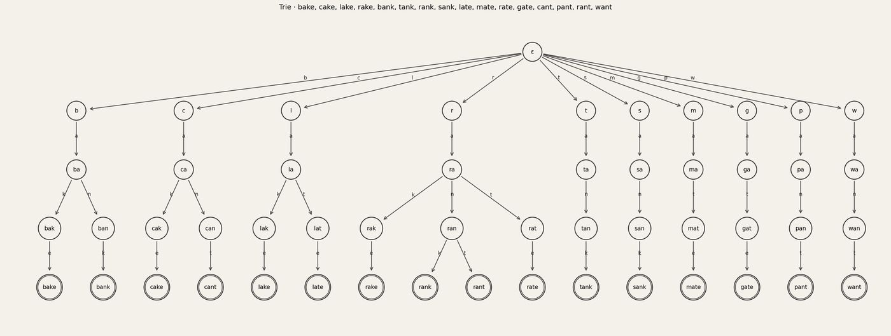

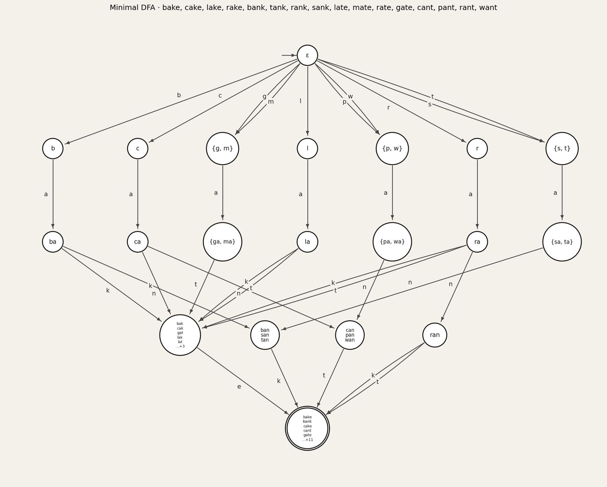

### 2.3 Network architecture

We use a single-layer Elman RNN implemented in NumPy (`rnn/min_char_rnn.py`). Let \(V_\Sigma = |\Sigma|\) be the alphabet size and \(H = 50\) the hidden width. Inputs are one-hot vectors \(\mathbf{x}_t \in \{0,1\}^{V_\Sigma}\). Parameters are
\[
W_{xh} \in \mathbb{R}^{H \times V_\Sigma},\quad
W_{hh} \in \mathbb{R}^{H \times H},\quad
W_{hy} \in \mathbb{R}^{V_\Sigma \times H},
\]
with biases \(\mathbf{b}_h, \mathbf{b}_y\). The forward map is
\begin{align}
\mathbf{a}_t &= W_{xh}\mathbf{x}_t + W_{hh}\mathbf{h}_{t-1} + \mathbf{b}_h, \\
\mathbf{h}_t &= \tanh(\mathbf{a}_t), \\
\boldsymbol{\ell}_t &= W_{hy}\mathbf{h}_t + \mathbf{b}_y, \\
\hat{\mathbf{p}}_t &= \mathrm{softmax}(\boldsymbol{\ell}_t),
\end{align}
and the loss at each step is the cross-entropy \(-\log \hat{p}_t(x_{t+1})\).

Weights are initialized i.i.d. Gaussian with scale \(0.01\). During training we apply hidden dropout with rate \(0.25\) and an L2 penalty of \(10^{-4}\). Backpropagation through time uses windows of length 12–16 characters depending on condition (16 for the anchor).

### 2.4 Training and behavioral metrics

Optimization uses the project’s standard SGD-style updates with learning rate taken from the experiment config (default for sixteen-word regimes). Every 50 iterations we evaluate validation cross-entropy and a **word-error / out-of-vocabulary rate**: the network generates long stochastic rollouts, and we measure the fraction of characters (or tokens, under a space-insertion heuristic for scoring) that fall outside legal vocabulary continuations. Training stops early when this rate remains at or below \(3\%\) for a patience window, subject to a minimum iteration count.

We report six seeds for the anchor (\(\{1,2,3,5,7,8\}\)) and three seeds for comparisons (\(\{1,2,3\}\)). All checkpoints analyzed in this manuscript have `hidden_size = 50`. Older \(H = 128\) runs in the repository are excluded from paper statistics.

### 2.5 Representational analyses

**Activations.** For a held-out analysis window of length \(L = 64\) (anchor), we record \(\mathbf{h}_t\), softmax outputs, and all DFA/character/position labels. Where noted, we *condense* timesteps that share the same in-word prefix by averaging, so each unique prefix contributes one point.

**Dimensionality reduction.** We project \(\{\mathbf{h}_t\}\) with PCA (primary), and for visualization also UMAP, t-SNE, and Isomap. Word trajectories are plotted as paths in the top two PCs. Closed-loop trajectories use the network’s own samples as input.

**Feature separation.** For a categorical label \(f\) (DFA state, character, position, …) we compute: (i) multivariate \(\eta^2\) (fraction of total variance explained by class means); (ii) mean silhouette; (iii) centroid gap (between- vs within-class spread); (iv) pairwise within/between distance ratios; (v) shuffle-based \(z\)-scores and \(p\)-values.

**Linear decoding.** We fit multinomial logistic regression to predict each label from (a) the top \(k\) principal components or (b) a random subset of \(k\) neurons (30 draws). We plot chance-corrected accuracy
\[
\frac{\mathrm{acc} - c}{1 - c},
\]
where \(c\) is chance for that label.

**Unit selectivity.** For each hidden unit we compute selectivity index (SI) and univariate \(\eta^2\) for each feature, then summarize primary-feature assignments and population medians.

**Weight structure.** We compare reconstructed random-init weights to final weights; report Frobenius norms and per-unit input-drive fraction
\[
\frac{\overline{|W_{xh}|}_{\text{row}}}{\overline{|W_{xh}|}_{\text{row}} + \overline{|W_{hh}|}_{\text{row}}}.
\]
We reorder units by hierarchical clustering on concatenated input/recurrent features and compute motif scalars: off-block mass in \(|W_{hh}|\) (*block coupling*), mean within-block correlation of \(W_{xh}\) rows (*cluster cohesion*), and normalized row-entropy of \(|W_{xh}|\) (*input tuning entropy*).

---

## 3. Results

### 3.1 Learning the lexicon without seeing boundaries

Figure 3 shows training dynamics for the anchor model (seed 2). Cross-entropy per character falls sharply within the first several hundred iterations and then fluctuates around a low plateau. By contrast, the rollout out-of-vocabulary rate remains high and volatile until roughly 2,500–4,000 iterations, after which it collapses toward the \(3\%\) stopping threshold. This dissociation matters conceptually: local next-character loss can improve while the model still fails to emit globally legal words. Lexical validity is a slower, more structural achievement.


Figure 4 makes the behavioral endpoint concrete. A corpus excerpt (top) shows the concatenated stream. A sample at initialization (middle) is unstructured with respect to the lexicon. A sample after training (bottom) consists almost entirely of legal words from \(V\). Across seeds 1, 2, 3, 5, 7, and 8, early stopping occurred between approximately 4,250 and 22,350 iterations, with final word-error rates between roughly 1.9% and 2.6%.


Thus, at the level of behavior, the RNN solves a segmentation-relevant problem: it generates word-like units despite never observing spaces.

### 3.2 Learned weights: input dominance with recurrent block structure

Figure 5 shows the final input matrix \(W_{xh}\) and recurrent matrix \(W_{hh}\). Input columns are letter-specific; recurrent weights are dense but far from unstructured noise. Figure 5a compares these matrices to their random initializations and plots the deltas. Both input and recurrent magnitudes grow by orders of magnitude, but input grows more.

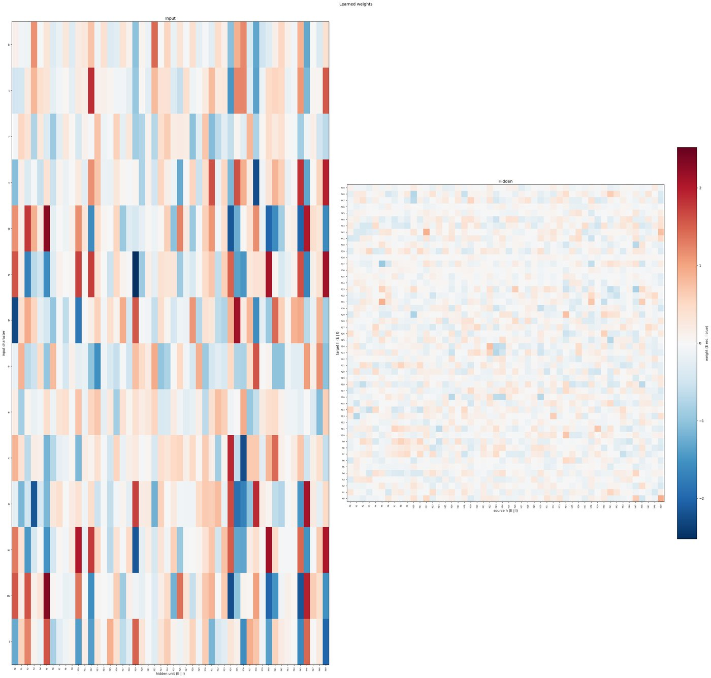

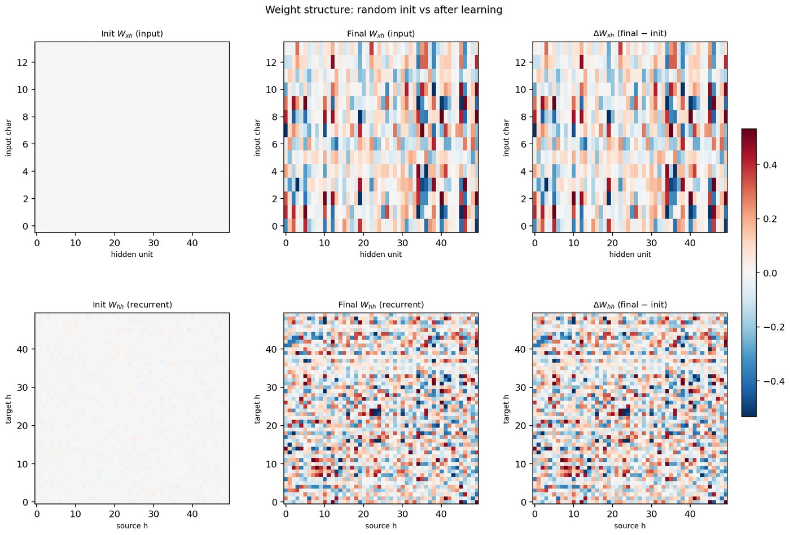

To make motifs visible, we reorder hidden units by hierarchical clustering on concatenated input and recurrent features (Figures 5b–5c). The reordered \(W_{hh}\) exhibits block-like coupling; the reordered \(W_{xh}\) shows sparse letter tuning across clusters.

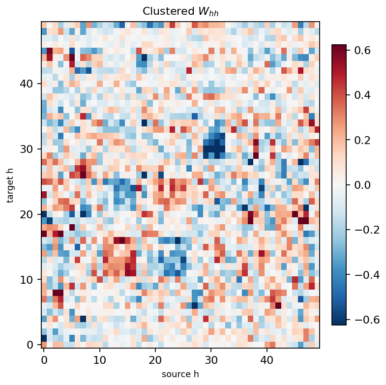

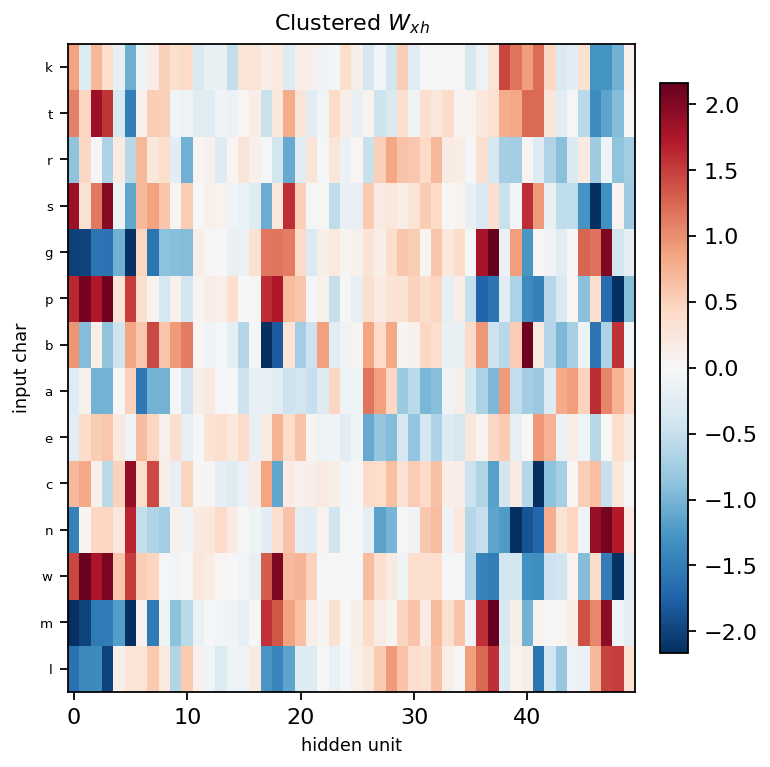

Quantitative summaries (Figures 5d–5e; seed 2) are:

| Metric | Init | Final |
|--------|-----:|------:|
| \(\|W_{xh}\|_F / \|W_{hh}\|_F\) | 0.53 | 2.00 |
| Mean input-drive fraction | 0.50 | 0.71 |
| Block coupling (off-block \(|W_{hh}|\)) | — | 0.68 |
| Cluster cohesion (within-block \(W_{xh}\) corr.) | — | 0.22 |
| Input tuning entropy (normalized) | — | 0.90 |

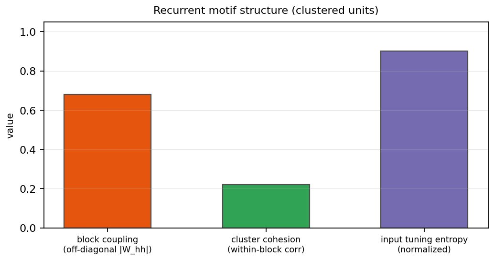

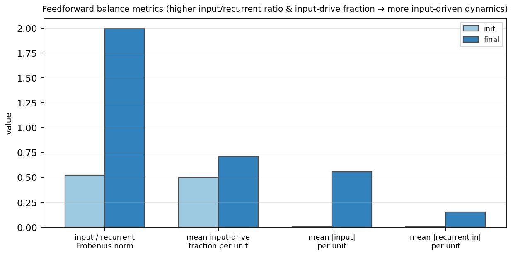

Interpretation: the trained network is not a pure autonomous oscillator, nor a pure feedforward letter detector. It becomes **more input-driven** while retaining substantial recurrent coupling—exactly the combination needed to read letters and maintain prefix memory.

### 3.3 Hidden states organize by prefix and DFA state

We next examine activations over a 64-character analysis window. Figure 6 shows the raw hidden-unit heatmap. Figure 7 shows the corresponding softmax next-character distribution: probability mass concentrates when the trie is narrow (late in a word) and spreads at early ambiguous prefixes.

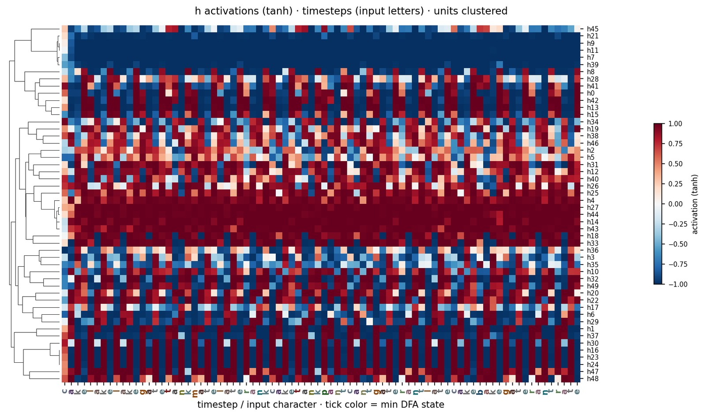

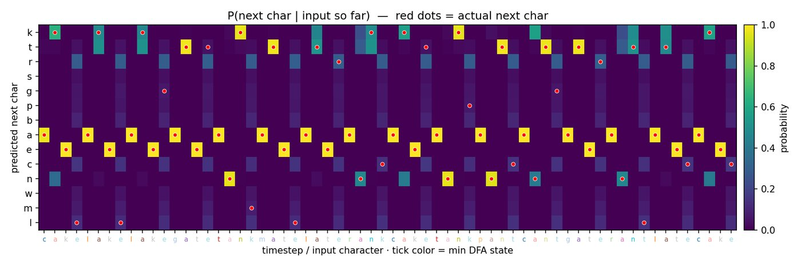

A critical qualitative test is whether the same input letter produces the same hidden pattern regardless of context. Figure 8 groups timesteps by input character and labels columns by in-word prefix. Occurrences of, for example, *a* after different prefixes yield systematically different activation profiles. The network encodes *where it is inside the current word*, not merely *which letter just arrived*.

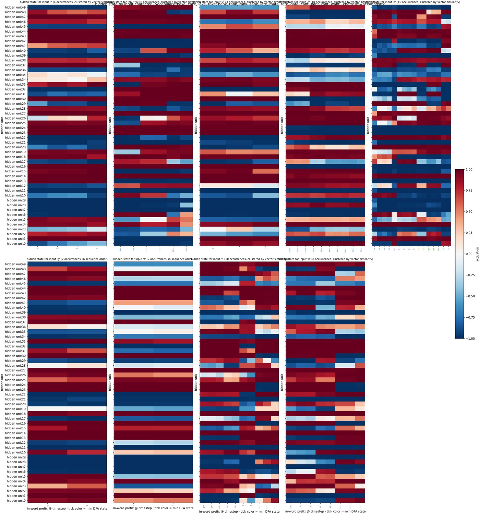

Unsupervised clustering of the full activation matrix (Figure 9) recovers blocks of timesteps with near-identical hidden vectors; many blocks align with shared prefixes. Nonlinear embeddings (Figure 10) likewise group prefix-annotated points into coherent regions.

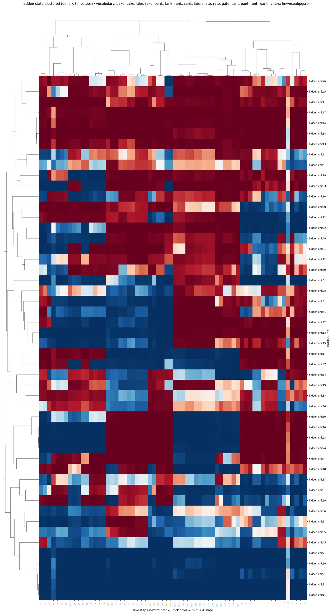


Figure 11 is the central qualitative result. The left panel repeats the minimal DFA; the right panel shows PCA of \(\mathbf{h}_t\) colored by DFA state. Points that share a DFA color form clusters even when their prefix strings differ in length. Trajectories through individual words visit a sequence of colors as successive letters refine the lexical hypothesis set. In that sense, the continuous geometry *implements* the automaton.

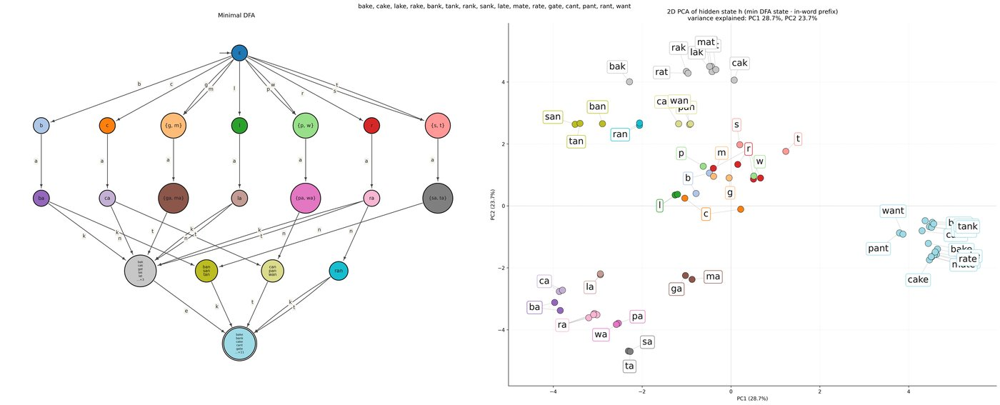

Readout geometry is consistent with this picture. Figure 12 shows argmax next-character regions and prediction entropy over the PCA plane; Figure 13 decomposes probability mass per character. Low-entropy regions correspond to late, highly constrained prefixes; high-entropy regions sit at branch points.

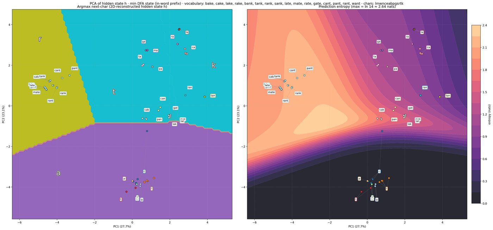

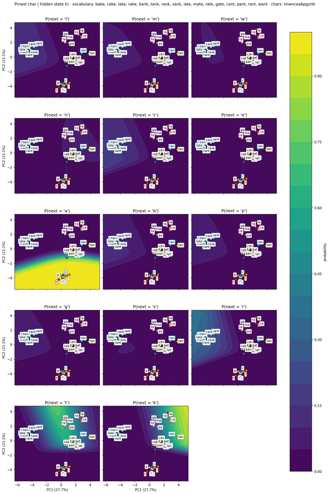

Word-level trajectories (Figure 14) make segmentation visible as repeated geometric motifs: each word is a path through state space; words that share onsets share early path segments; completing a word returns the state toward a boundary-like region from which a new word can begin.

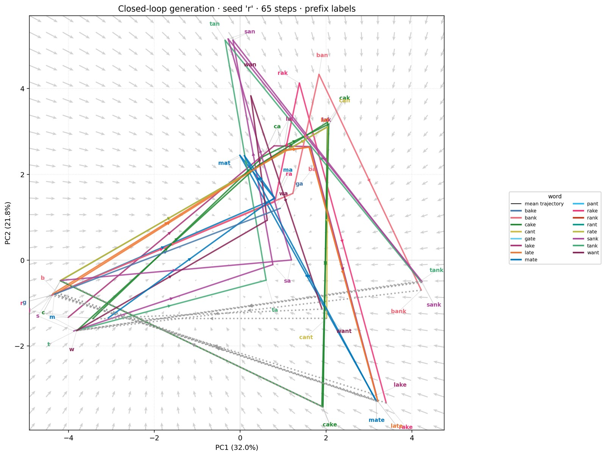

Finally, pairwise correlations among hidden vectors (Figures 15–16) recover blocks that align with DFA equivalence when rows/columns are clustered or explicitly grouped by DFA state. Correlation structure in the full \(H\)-dimensional space agrees with the low-dimensional PCA story.

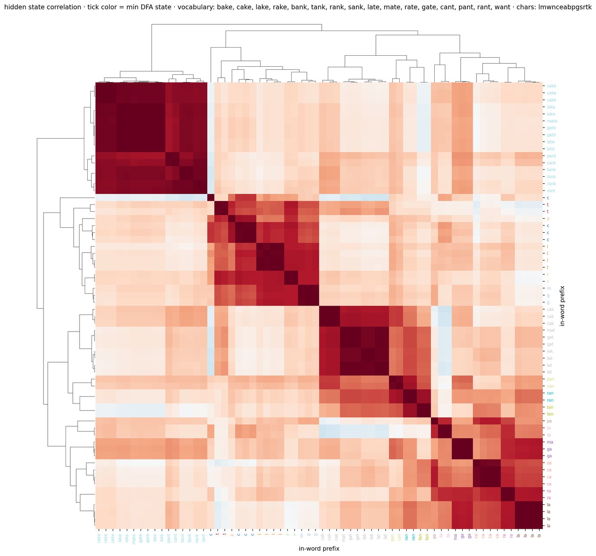

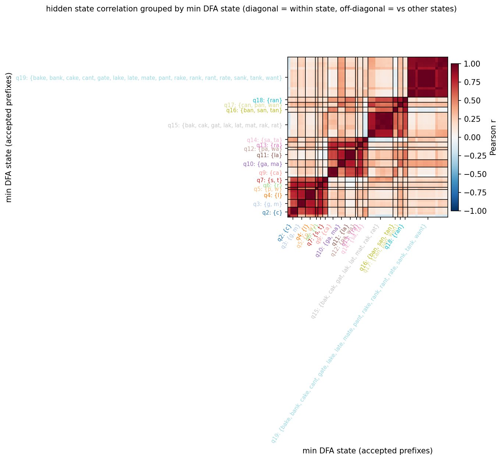

### 3.4 Population separation and linear decoding

Qualitative geometry is corroborated by population metrics on condensed prefixes (Figures 17–18). Across centroid gap, silhouette, multivariate \(\eta^2\), and within/between ratios, **DFA state** is the best-separated feature on the anchor. For the seed-2 condensed analysis, DFA \(\eta^2 \approx 0.95\) and silhouette \(\approx 0.69\), versus weaker separation for current character and within-word position. Shuffle controls remain significant for all features, but the ranking favors the automaton.


Unit-level summaries agree. Population median univariate \(\eta^2\) across hidden units is 0.97 for DFA state, 0.84 for prefix, 0.67 for character, and 0.40 for position (Figure 21). Many units are primarily DFA- or prefix-selective; a substantial fraction are mixed, indicating a distributed code rather than a single “boundary neuron.”


Linear decoding asks a complementary question: how many dimensions are needed to *read out* each feature? Figure 19 plots chance-corrected accuracy against the number of principal components (top) or randomly sampled neurons (bottom). For seed 2:

| Feature | PCs to reach \(\geq 0.95\) | PCs to reach \(\geq 0.99\) |
|---------|---------------------------:|---------------------------:|
| Position from beginning | 2 | 2 |
| Position from end | 2 | 3 |
| DFA state | 3 | 5 |
| Current character | 7 | 10 |

Full hidden-state decoding reaches ceiling for all four features. Structural variables therefore live in a low-dimensional subspace; character identity requires more dimensions. This is consistent with a geometry organized primarily by automaton state and ordinal position, with letter identity written into finer directions.

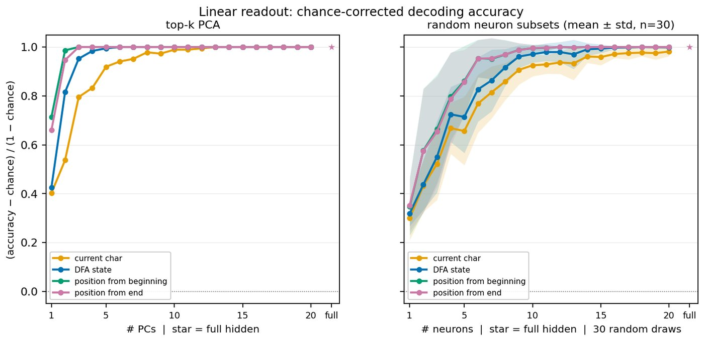

### 3.5 Realizability across seeds

A single lucky seed would be weak evidence. Figure 20 repeats the decoding analysis for seeds 1, 2, 3, 5, 7, and 8. The saturation order is stable: position and DFA rise fastest; character lags. Closed-loop trajectory insets differ—some runs form triangular loops, others more complex polygons—but all exhibit word-labeled vertices and repeated cyclic structure. We interpret this as multiple dynamical realizations of the same computational solution: embed the DFA, then read out next characters.

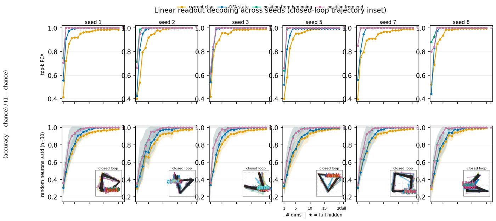

### 3.6 Word length and length mixing change the code

Figures 22–23 compare the four 16-word conditions at \(H = 50\), seeds \(\{1,2,3\}\). All conditions learn: validation loss falls and word-error rates reach the stopping criterion (Figure 22). The representational profile, however, is not identical (Figure 23; Table below reports mean multivariate \(\eta^2\)).

| Condition | DFA \(\eta^2\) | Char \(\eta^2\) | Position \(\eta^2\) |
|-----------|---------------:|----------------:|--------------------:|
| 3-letter | 0.91 | 0.92 | 0.70 |
| 4-letter (anchor) | 0.95 | 0.70 | 0.69 |
| 5-letter | 0.98 | 0.77 | 0.47 |
| Mixed 3–5 | 0.86 | 0.89 | 0.61 |


Two patterns stand out. First, **fixed longer words** (4- and especially 5-letter) yield the highest DFA \(\eta^2\). Longer unique paths through the trie make automaton states more distinctive, and position becomes partially redundant with DFA state under fixed length. Second, **short and mixed** streams raise character \(\eta^2\) relative to DFA. When length is short, local letter identity carries more of the predictive burden; when length varies, ordinal position is no longer a reliable proxy for “how much of the word remains,” and the network leans more on character-centric features. Mixed length therefore does not abolish DFA structure (\(\eta^2 = 0.86\)), but it softens the clean automaton geometry seen in the anchor.

---

## 4. Discussion

### 4.1 Segmentation as emergent predictive geometry

The central claim of this paper is modest but sharp: a generic next-character RNN, trained without boundary supervision on a finite unsegmented lexicon, develops hidden states that implement the vocabulary’s minimal DFA. Behaviorally, the model emits legal words. Representationally, DFA state is the best-separated population feature on the fixed-length anchor, is linearly decodable from a handful of principal components, and dominates unit selectivity. Statistical word segmentation, in this setting, is what successful prediction looks like from the inside of the network.

This aligns with the spirit of Elman (1990) while making the target automaton explicit and measurable. It also resonates with modern analyses of recurrent networks as implementers of dynamical systems and discrete machines (Sussillo & Barak, 2013; Maheswaranathan et al., 2019): here the machine is not hypothesized post hoc but derived from the lexicon before training.

### 4.2 Why the DFA, not just the character?

Next-character prediction is formally a function of the predictive state. For a finite lexicon without separators, that state *is* the DFA state (up to the learner’s uncertainty about boundaries, which collapses as words are completed). Character identity is always available in the input, yet on the 4-letter anchor it explains less hidden variance than DFA state and requires more principal components to decode. The network therefore does not merely relay the current letter; it maintains the hypothesis set over words.

### 4.3 Weights as implementation-level evidence

The weight analyses are not decorative. The shift toward input-dominated drive, together with recurrent block coupling and clustered letter tuning, sketches an implementation: letters inject strong, structured currents into a recurrent substrate that mixes units into prefix-sensitive modes. We prefer these motif metrics to eigenspectra for the main text because they connect more directly to the clustering visible in \(W_{xh}\) and \(W_{hh}\).

### 4.4 Length regimes as a window onto cue use

The comparison across length conditions suggests a graded tradeoff. Fixed length makes ordinal position and automaton state highly aligned; mixed length breaks that alignment and increases reliance on character identity. If analogous tradeoffs exist in human statistical learning, one would predict that variable-length artificial languages should yield stronger sensitivity to local transitional probabilities and weaker evidence for abstract “state-like” codes—an empirical question for future behavioral and neural work.

### 4.5 Limitations

Several limits bound the present claims. The languages are character-level and tiny by natural-language standards. We analyze \(H = 50\) only. Comparisons use three seeds; realizability uses six on the anchor alone. We do not model acoustic noise, speaker variability, or prosodic cues that matter in infant experiments. We also do not claim that infants are Elman networks; the model is a *hypothesis generator* for what prediction-based learners can do, not a literal neural implementation.

### 4.6 Future directions

Natural extensions include: (i) scaling to 32-word mixed lexicons under the same analysis stack; (ii) Dale-law constrained recurrence as a step toward biologically harder circuits; (iii) explicit boundary probes (e.g., TRACX-style chunk scores) read out from \(\mathbf{h}_t\); (iv) relating closed-loop turn-regularity metrics to segmentation quality; and (v) comparing transformers under matched corpora to ask which geometric signatures are architecture-general.

---

## 5. Conclusion

We trained small Elman RNNs to predict the next character in unsegmented artificial languages and asked whether their hidden states discover word structure. They do. On a 16-word, 4-letter anchor at hidden size 50, the network’s state space aligns with the vocabulary’s minimal DFA: population separation, linear decoding, and unit selectivity all point to automaton state as a primary organizing axis. This solution recurs across seeds, and it softens—but does not vanish—when word length is mixed. The results support a simple mechanistic moral: when the world is a finite lexicon streamed without boundaries, statistical segmentation is the geometry of prediction.

---

## Acknowledgments

*(to be added)*

---

## References

Aslin, R. N., Saffran, J. R., & Newport, E. L. (1998). Computation of conditional probability statistics by 8-month-old infants. *Psychological Science, 9*(4), 321–324.

Alhama, R. G., & Zuidema, W. (2019). A review of computational models of human learning of artificial languages. *Cognitive Science* / related survey literature on neural models of statistical learning.

Elman, J. L. (1990). Finding structure in time. *Cognitive Science, 14*(2), 179–211.

Elman, J. L. (1991). Distributed representations, simple recurrent networks, and grammatical structure. *Machine Learning, 7*, 195–225.

Frank, M. C., Goldwater, S., Griffiths, T. L., & Tenenbaum, J. B. (2010). Modeling human performance in statistical word segmentation. *Cognition, 117*(2), 107–125.

French, R. M., Addyman, C., & Mareschal, D. (2011). TRACX: A recognition-based connectionist framework for sequence segmentation and chunk extraction. *Psychological Review, 118*(4), 614–636.

Goldwater, S., Griffiths, T. L., & Johnson, M. (2009). A Bayesian framework for word segmentation: Exploring the effects of context. *Cognition, 112*(1), 21–54.

Hopcroft, J. E., Motwani, R., & Ullman, J. D. (2006). *Introduction to Automata Theory, Languages, and Computation* (3rd ed.). Addison-Wesley.

Maheswaranathan, N., Williams, A. H., Golub, M. D., Mel, G., & Sussillo, D. (2019). Universality and individuality in neural dynamics across large populations of recurrent networks. *NeurIPS*.

Mante, V., Sussillo, D., Shenoy, K. V., & Newsome, W. T. (2013). Context-dependent computation by recurrent dynamics in prefrontal cortex. *Nature, 503*, 78–84.

Perruchet, P., & Vinter, A. (1998). PARSER: A model for word segmentation. *Journal of Memory and Language, 39*(2), 246–263.

Saffran, J. R., Aslin, R. N., & Newport, E. L. (1996). Statistical learning by 8-month-old infants. *Science, 274*(5294), 1926–1928.

Sussillo, D., & Barak, O. (2013). Opening the black box: Low-dimensional dynamics in high-dimensional recurrent neural networks. *Neural Computation, 25*(3), 626–649.

---

## Appendix A. Reproducibility

All figures in this manuscript are copied (not moved) into [`figures/`](figures/manifest.json) (`demo/`, `main/`, `compare/`). Regenerate the copy set with:

```text
python scripts/paper_collect_figures.py
```

Training and visualization entry points:

```text
python scripts/run_task.py sixteen_word_four_letter_ns --seeds 1 2 3 5 7 8
python scripts/compare.py --preset sixteen_word_345_ns --seeds 1 2 3 --kinds learning_summary feature_separation
```

Checkpoints used for paper statistics have `hidden_size = 50`. Comparison metrics use seeds `(1, 2, 3)` only.

---

## Appendix B. Figure list

| Fig. | File | Content |
|------|------|---------|
| 1 | `demo/fig01_trie.svg` | Vocabulary trie |
| 2 | `demo/fig02_dfa.svg` | Minimal DFA |
| 3 | `demo/fig03_learning_curve.png` | Training dynamics |
| 4 | `demo/fig04_samples.png` | Before/after samples |
| 5–5e | `main/fig05*.png` | Weights, clustering, motifs |
| 6–10 | `main/fig07`–`fig11` | Activations and embeddings |
| 11 | `main/fig12_dfa_embedding.png` | DFA vs PCA (central) |
| 12–14 | `main/fig13`, `fig14`, `fig16` | Readout and trajectories |
| 15–18 | `main/fig17`–`fig20` | Correlations and separation |
| 19–21 | `main/fig_decoding*`, `fig_unit_selectivity` | Decoding and units |
| 22–23 | `compare/fig_compare_*` | Cross-condition comparison |
