# Statistical Word Segmentation as Emergent Structure in a Next-Character RNN

**Working title** · Hidden size \(h = 50\) throughout

---

## Abstract

Eight-month-old infants can segment continuous speech by tracking transitional probabilities between syllables (Saffran, Aslin, & Newport, 1996). We ask whether a vanilla Elman RNN trained only on next-character prediction develops internal representations aligned with word structure. After learning, the network generates legal vocabulary items, and its hidden states become a continuous embedding of the vocabulary’s minimal DFA.

A four-word demo (*cat*, *met*, *ate*, *tea*) introduces the trie, DFA, learning, and generated text. On a 16-word, 4-letter condition, DFA state explains \(\eta^2 \approx 0.95\) of condensed hidden variance and is linearly decodable from a few principal components (mean ± std across six seeds). Word trajectories form labeled geometric motifs. Weight structure on that same condition shows letter-columnar \(W_{xh}\) and locally clumped \(W_{hh}\). Cross-condition comparisons then vary word length at fixed vocabulary size, and vocabulary size at fixed word length.

---

## 1. Introduction

Fluent speech arrives without reliable pauses. Infants can use transitional probabilities to find word-like units (Saffran et al., 1996; Aslin, Saffran, & Newport, 1998). Computational accounts range from Bayesian segmentation and chunking (Goldwater, Griffiths, & Johnson, 2009; Perruchet & Vinter, 1998; French, Addyman, & Mareschal, 2011) to predictive sequence models (Elman, 1990).

For a finite vocabulary streamed without separators, optimal next-character prediction depends on the state of the vocabulary’s minimal DFA—the equivalence class of in-word prefixes with identical futures. An Elman RNN has no word units and no boundary channel, yet if it solves the prediction task its hidden state \(\mathbf{h}_t\) must carry that information. We test whether the information is geometrically organized.

**Plan.** (1) Four-word demo. (2) Single 16-word condition: next-character probabilities, activations, PCA + separation, decoding, trajectories, then weight structure. (3) Comparisons across length and vocabulary size.

---

## 2. Methods

**Demo lexicon** (`four_word_overlap_ns`): cat, met, ate, tea (vowels *a*/*e*; overlapping structure, not a single shared suffix).

**Main condition** (`sixteen_word_four_letter_ns`): bake, cake, lake, rake, bank, tank, rank, sank, late, mate, rate, gate, cant, pant, rant, want.

**Comparisons.** Length at 16 words: 3 / 4 / 5 letter. Vocabulary size at 4-letter words: 8 / 16. Seeds \(\{1,2,3\}\) for grids; decoding aggregates seeds \(\{1,2,3,5,7,8\}\); weight metrics use all available checkpoints (\(n=16\)).

**Model.** Elman RNN, \(H = 50\), next-character cross-entropy, early stop on word-error \(\leq 3\%\).

**Analyses.** Softmax next-character probabilities; activation heatmaps; hierarchical clustering of timesteps; PCA embeddings; feature separation (\(\eta^2\), silhouette, …); linear decoding from top-\(k\) PCs or random neurons (chance-corrected; mean ± std across seeds); closed-loop word trajectories; multi-seed clustered init-vs-final weights and motif scalars.

Trie and DFA figures are shown **only** for the four-word demo.

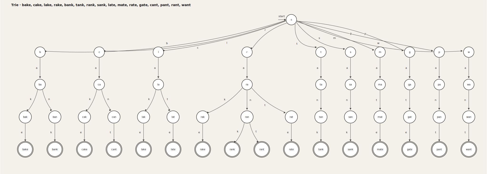

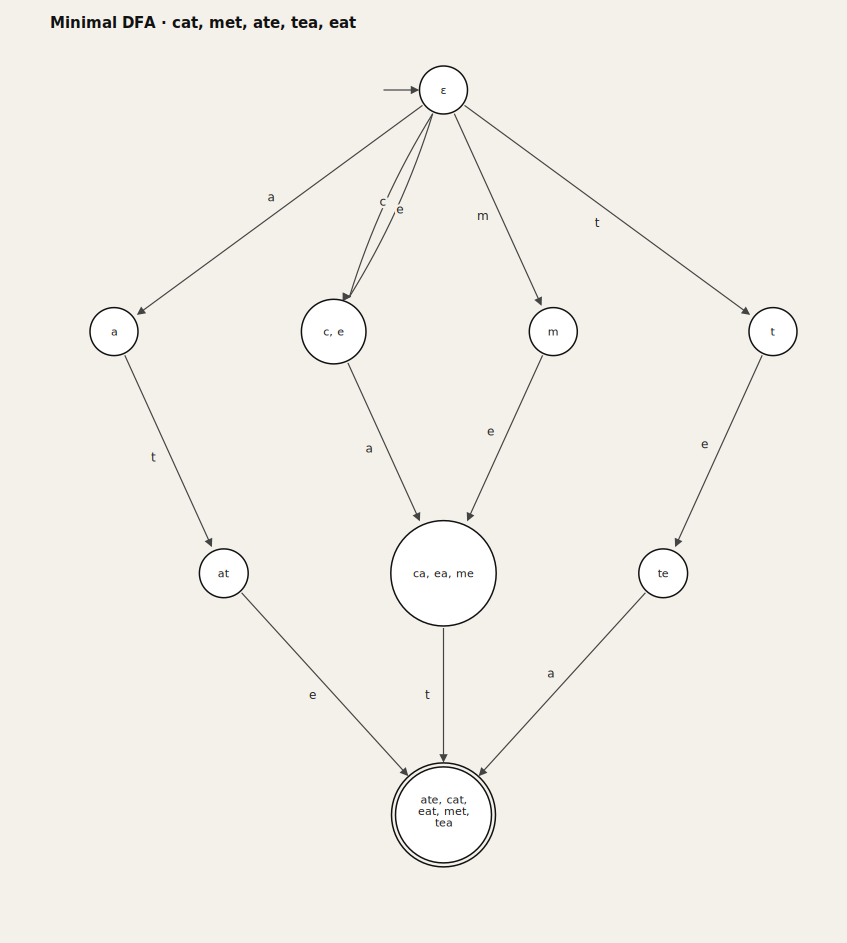

---

## 3. Results

### 3.1 Four-word demo

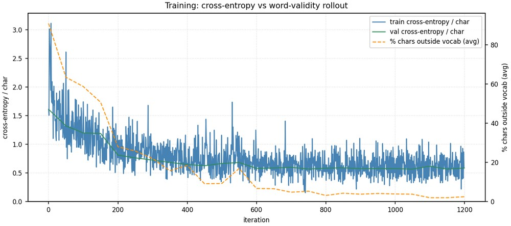

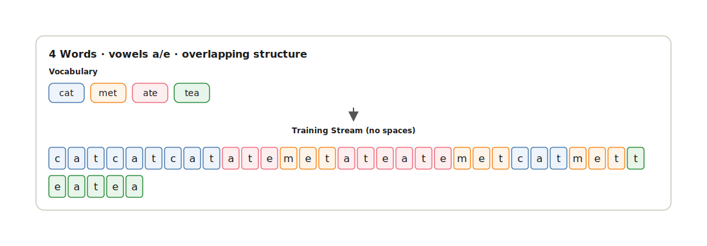

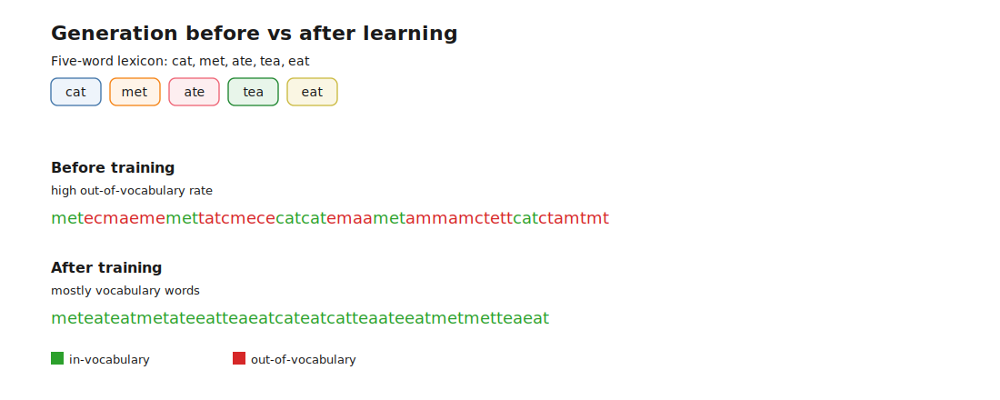

Unless noted, the remainder uses the **16-word, 4-letter** condition.

### 3.2 Next-character probabilities

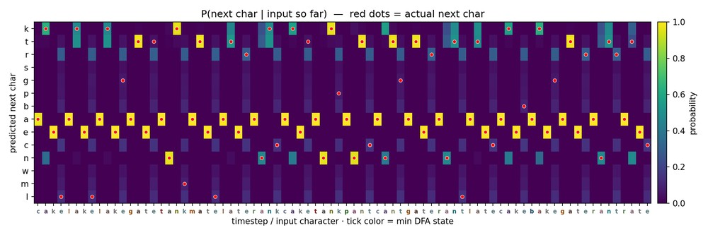

Probability mass concentrates late in words and spreads at ambiguous prefixes.

### 3.3 Hidden states and clustering

### 3.4 PCA geometry and population separation

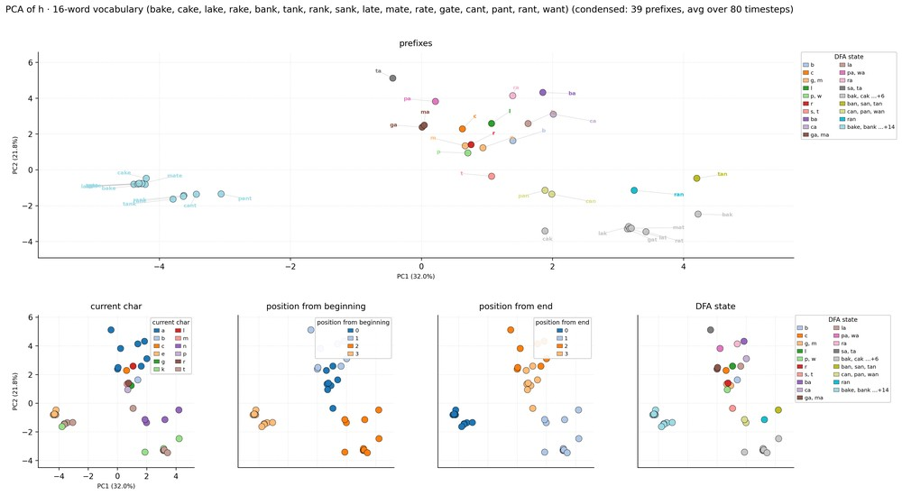

Prefix-labeled points form coherent regions in the plane. Coloring by character, within-word position, and DFA state shows the same geometry organized by different features.

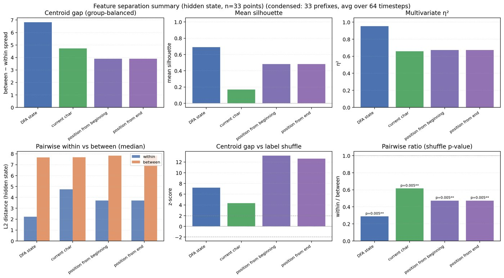

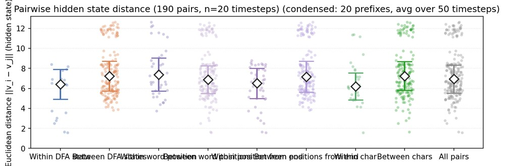

DFA state dominates (\(\eta^2 \approx 0.95\)). Unit selectivity agrees (population median \(\eta^2\): DFA 0.97, prefix 0.84, character 0.67, position 0.40).

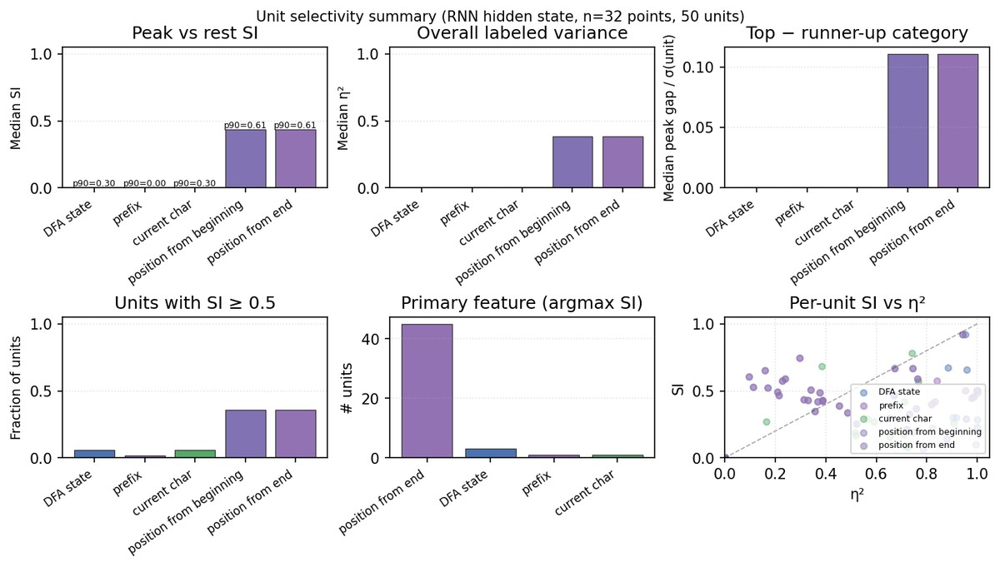

### 3.5 Decoding

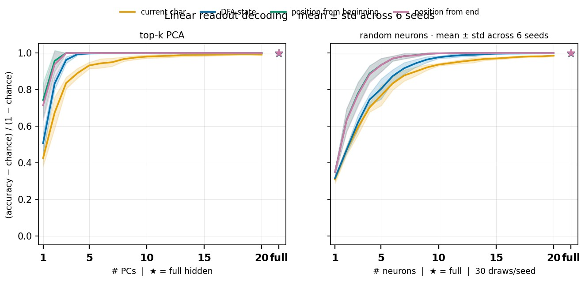

Position and DFA saturate within a few PCs; character needs more dimensions.

### 3.6 Word trajectories

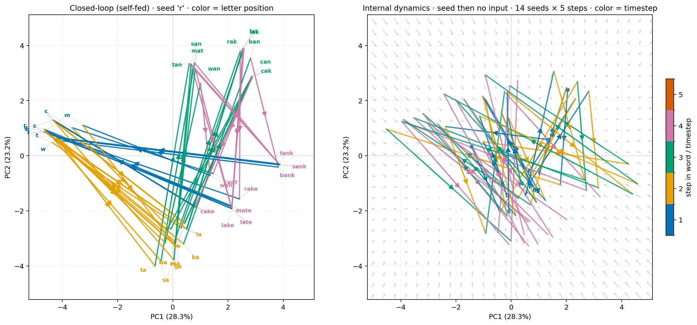

Left: autoregressive generation with prefix labels, segments colored by in-word letter position. Right: letter seed then recurrent dynamics with no further input, colored by timestep; background vector field from the no-input map.

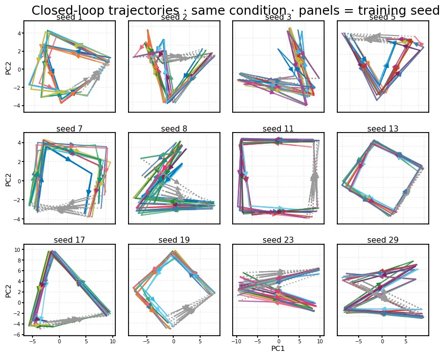

### 3.7 Weight structure (same 16-word condition)

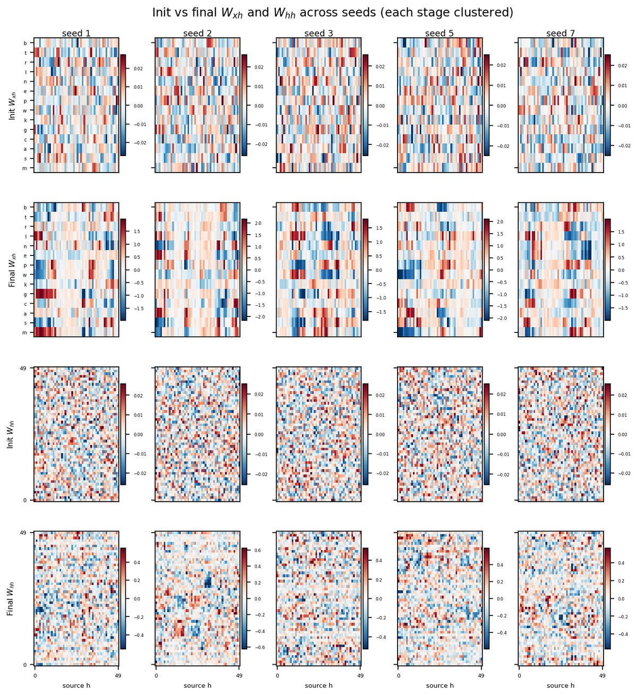

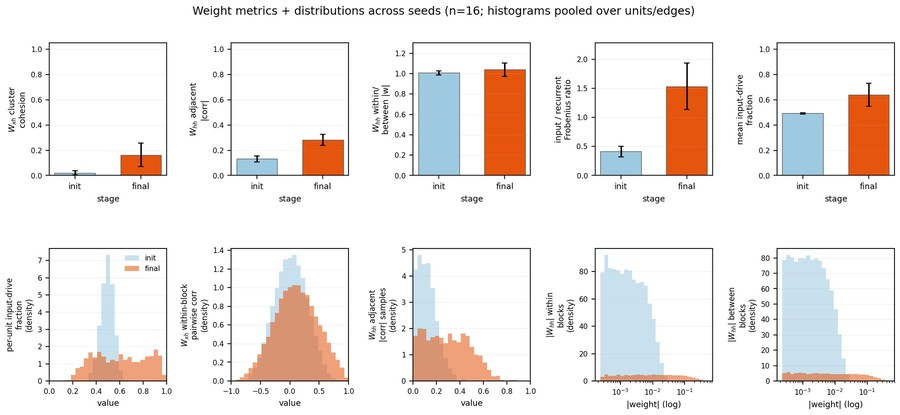

Final \(W_{xh}\) becomes **letter-columnar**: after clustering, units form coherent vertical stripes (shared signed input profiles). Across all seeds, within-block cohesion rises from \(0.02 \pm 0.02\) to \(0.16 \pm 0.09\). The pooled within-block pairwise-correlation histogram shifts right accordingly. Input/recurrent Frobenius ratio rises from \(0.41 \pm 0.09\) to \(1.53 \pm 0.40\); mean input-drive fraction from \(0.49 \pm 0.01\) to \(0.64 \pm 0.09\), with the per-unit drive-fraction histogram moving toward input dominance.

Final \(W_{hh}\) becomes **locally clumped** along the cluster order: adjacent-unit \(|\mathrm{corr}|\) doubles from \(0.13 \pm 0.03\) to \(0.28 \pm 0.04\) (see sample histogram). Mean within/between \(|W_{hh}|\) stays near 1: both within- and between-block magnitude histograms inflate similarly after learning, so the structure is local neighborhood coupling rather than a clean block-diagonal partition.

### 3.8 Comparisons across length and vocabulary size

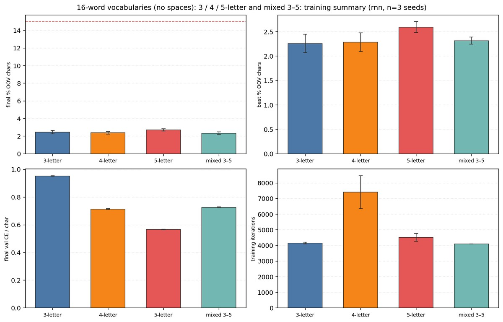

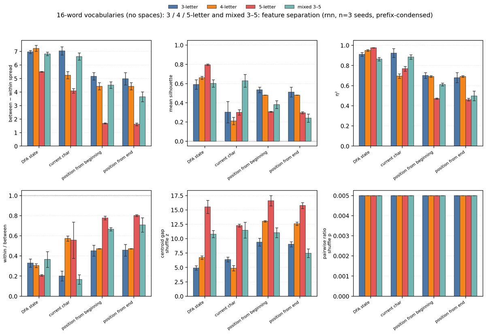

| Condition | DFA \(\eta^2\) | Char \(\eta^2\) | Position \(\eta^2\) |
|-----------|---------------:|----------------:|--------------------:|
| 3-letter | 0.91 | 0.92 | 0.70 |
| 4-letter | 0.95 | 0.70 | 0.69 |
| 5-letter | 0.98 | 0.77 | 0.47 |
| Mixed 3–5 | 0.86 | 0.89 | 0.61 |

Fixed longer words preserve the strongest DFA geometry; mixed length elevates character \(\eta^2\).

We next expand the grid to powers-of-two vocabulary sizes (\(1\)–\(32\) words) crossed with word lengths \(1\)–\(6\) plus mixed, using a shared hidden size \(H = 100\) (mean over seeds \(1\)–\(5\)).

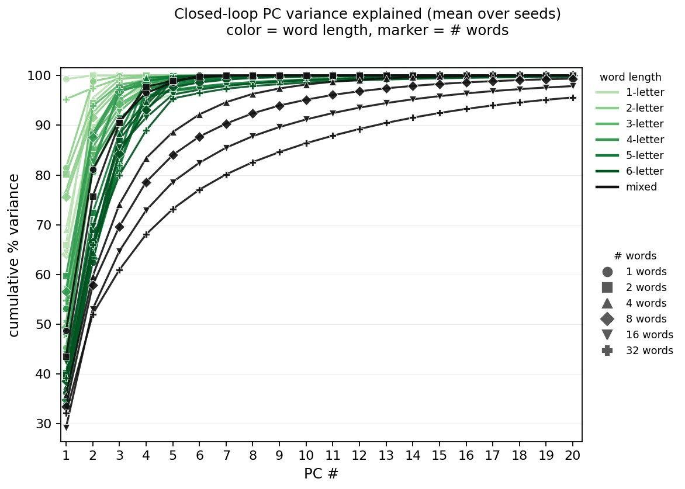

Smaller lexicons concentrate variance in the first one or two PCs: several 1- and 2-word cells reach \(\approx 100\%\) by PC 2. Increasing either word count or letter length stretches the spectrum—more PCs are needed before the cumulative curve saturates. Mixed-length vocabularies are the most distributed: at 32 mixed words, PC 1 accounts for only \(\approx 29\%\) of closed-loop variance and the cumulative share is still climbing slowly past PC 10.

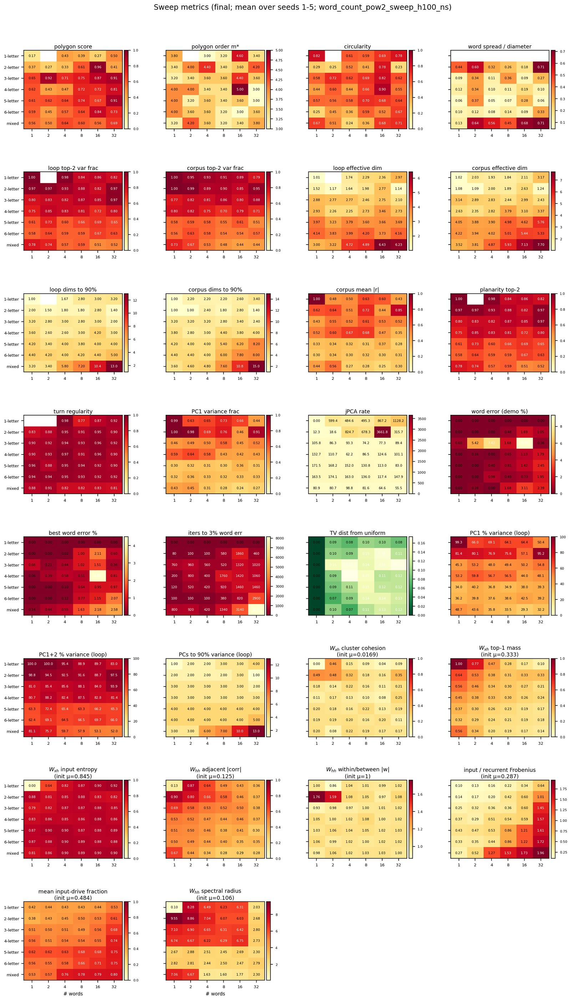

Geometry panels track the same expansion of dimensionality: loop and corpus top-2 variance fractions are highest for tiny lexicons and fall as words/letters increase, while effective dimension and “PCs to 90%” climb in the opposite direction. Training difficulty moves with the same axes—iterations to a 3% word-error target and residual demo error rise toward larger/mixed cells—yet TV distance from uniform generation stays modest once models train. Weight structure develops selectively: \(W_{xh}\) cohesion and \(W_{hh}\) adjacent correlation emerge most strongly for the easiest (few-word) cells, whereas input/recurrent Frobenius ratio and per-unit input-drive fraction increase toward longer and larger vocabularies (init baselines near \(0.02\) cohesion, \(0.13\) adjacent \(|\mathrm{corr}|\), \(0.29\) Frobenius ratio, \(0.48\) drive fraction).

---

## 4. Discussion

Next-character prediction on an unsegmented finite lexicon yields DFA-aligned hidden geometry. The four-word demo makes the task transparent. On the 16-word condition, population separation and multi-seed decoding show that automaton state is low-dimensional and stable. Trajectories form labeled geometric motifs that recur across training seeds. Weight analyses on that same condition show letter-columnar input weights and locally clumped recurrent connectivity. Length and vocabulary-size comparisons—including a powers-of-two \(H{=}100\) sweep—show that larger and mixed lexicons require higher-dimensional closed-loop representations while shifting feedforward vs recurrent weight balance.

**Limits.** Toy character languages; \(H = 50\); small seed counts for grids; no acoustic noise. The model is a hypothesis generator, not a claim that infants are Elman networks.

**Supplementary (omitted from main text).** DFA-beside-PCA composite; next-character decision-region / per-character readout heatmaps; activations grouped by input character; DFA-grouped correlation heatmaps; per-seed decoding panels with trajectory insets.

---

## 5. Conclusion

Small next-character RNNs discover word structure in unsegmented streams. States cluster by prefix and DFA identity; decoding recovers that structure across seeds; weight matrices develop letter-columnar \(W_{xh}\) and locally clumped \(W_{hh}\); trajectories and cross-condition comparisons show how the solution scales with length and vocabulary size.

---

## References

Aslin, R. N., Saffran, J. R., & Newport, E. L. (1998). *Psychological Science, 9*(4), 321–324.

Elman, J. L. (1990). Finding structure in time. *Cognitive Science, 14*(2), 179–211.

Frank, M. C., Goldwater, S., Griffiths, T. L., & Tenenbaum, J. B. (2010). *Cognition, 117*(2), 107–125.

French, R. M., Addyman, C., & Mareschal, D. (2011). TRACX. *Psychological Review, 118*(4), 614–636.

Goldwater, S., Griffiths, T. L., & Johnson, M. (2009). *Cognition, 112*(1), 21–54.

Perruchet, P., & Vinter, A. (1998). PARSER. *Journal of Memory and Language, 39*(2), 246–263.

Saffran, J. R., Aslin, R. N., & Newport, E. L. (1996). *Science, 274*(5294), 1926–1928.
