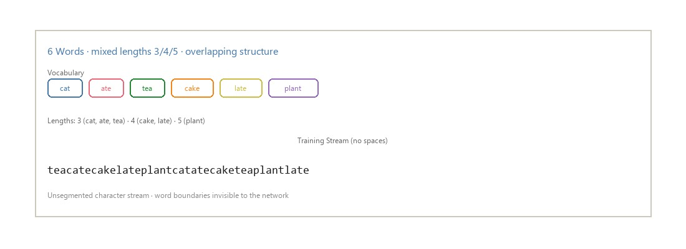
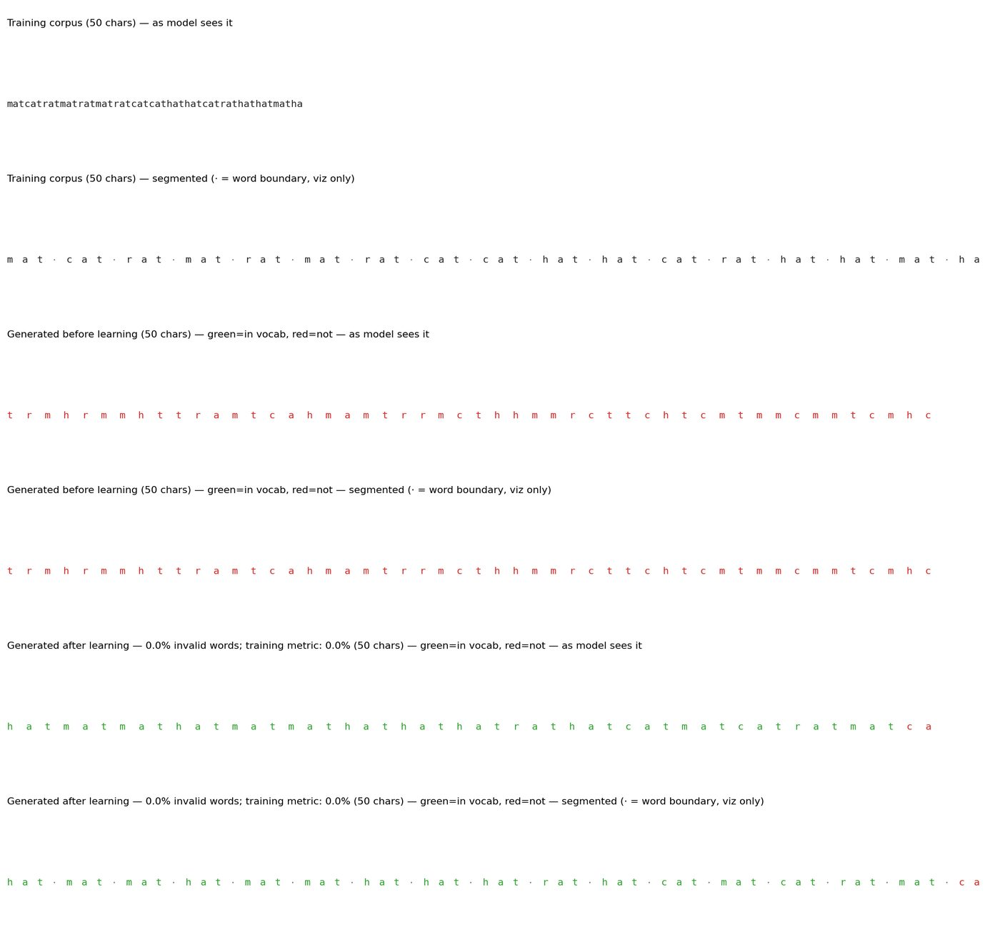
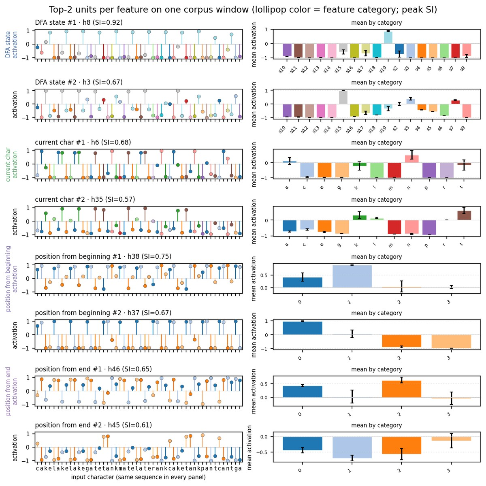

# Statistical Word Segmentation as Emergent Structure in a Next-Character RNN

**Working title** · Hidden size \(h = 50\) throughout

---

## Abstract

Eight-month-old infants can segment continuous speech by tracking transitional probabilities between syllables (Saffran, Aslin, & Newport, 1996). We ask whether a vanilla Elman RNN trained only on next-character prediction develops internal representations aligned with word structure. After learning, the network generates legal vocabulary items, and its hidden states become a continuous embedding of the vocabulary’s minimal DFA.

A five-word demo (*cat*, *met*, *ate*, *tea*, *eat*) introduces learning and generated text. On a 16-word, 4-letter condition, DFA state explains \(\eta^2 \approx 0.95\) of condensed hidden variance and is linearly decodable from a few principal components (mean ± std across six seeds). Word trajectories form labeled geometric motifs. Weight structure on that same condition shows letter-columnar \(W_{xh}\) and locally clumped \(W_{hh}\). A length × vocabulary-size sweep (\(H{=}100\); word counts \(5\)–\(25\) in steps of \(5\)) then shows that hidden dimensionality, training cost, and input vs recurrent weight balance track minimized DFA size—driven mainly by the number of words, and secondarily by word length / mixing.

---

## 1. Introduction

Fluent speech arrives without reliable pauses. Infants can use transitional probabilities to find word-like units (Saffran et al., 1996; Aslin, Saffran, & Newport, 1998). Computational accounts range from Bayesian segmentation and chunking (Goldwater, Griffiths, & Johnson, 2009; Perruchet & Vinter, 1998; French, Addyman, & Mareschal, 2011) to predictive sequence models (Elman, 1990).

For a finite vocabulary streamed without separators, optimal next-character prediction depends on the state of the vocabulary’s minimal DFA—the equivalence class of in-word prefixes with identical futures. An Elman RNN has no word units and no boundary channel, yet if it solves the prediction task its hidden state \(\mathbf{h}_t\) must carry that information. We test whether the information is geometrically organized.

**Plan.** (1) Five-word demo. (2) Single 16-word condition: next-character probabilities, activations, separation, single-unit selectivity, decoding, trajectories, then weight structure. (3) Comparisons across length and vocabulary size.

---

## 2. Methods

**Demo lexicon** (`five_word_overlap_ns`): cat, met, ate, tea, eat (vowels *a*/*e*; overlapping structure, not a single shared suffix).

**Main condition** (`sixteen_word_four_letter_ns`): bake, cake, lake, rake, bank, tank, rank, sank, late, mate, rate, gate, cant, pant, rant, want.

**Comparisons.** Length at 16 words: 3 / 4 / 5 letter. Vocabulary size at 4-letter words: 8 / 16. Seeds \(\{1,2,3\}\) for grids; decoding aggregates seeds \(\{1,2,3,5,7,8\}\); weight metrics use all available checkpoints (\(n=16\)).

**Model.** Elman RNN, \(H = 50\), next-character cross-entropy, early stop on word-error \(\leq 3\%\).

**Analyses.** Softmax next-character probabilities; activation heatmaps; hierarchical clustering of timesteps; PCA embeddings (colored by DFA state, position, and character); feature separation (\(\eta^2\), silhouette, …); per-unit selectivity with exemplar units; linear decoding from top-\(k\) PCs or random neurons (chance-corrected; mean ± std across seeds); closed-loop word trajectories; multi-seed clustered init-vs-final weights and motif scalars.

---

## 3. Results

### 3.1 Five-word demo

State colors match between the automaton and the DFA-colored PCA. The same geometry reorganized by position and character shows orthogonal feature structure without a separate legend.

Unless noted, the remainder uses the **16-word, 4-letter** condition.

### 3.2 Next-character probabilities

Probability mass concentrates late in words and spreads at ambiguous prefixes.

### 3.3 Hidden states and clustering

### 3.4 PCA geometry and population separation

DFA state dominates (\(\eta^2 \approx 0.95\)).

### 3.5 Single-unit selectivity

Per-unit selectivity uses a peak-vs-rest index on category-mean activations (flat units gated to 0). Population medians of per-unit \(\eta^2\) agree with the separation analysis (DFA 0.95, prefix 0.87, character 0.60, position 0.42). Individual units span that spectrum: some are sharply tuned to character or position, others track DFA state more diffusely.

### 3.6 Decoding

Position and DFA saturate within a few PCs; character needs more dimensions.

### 3.7 Word trajectories

Left: autoregressive generation with prefix labels, segments colored by in-word letter position. Right: letter seed then recurrent dynamics with no further input, colored by timestep; background vector field from the no-input map.

### 3.8 Weight structure (same 16-word condition)

Final \(W_{xh}\) becomes **letter-columnar**: after clustering, units form coherent vertical stripes (shared signed input profiles). Across all seeds, within-block cohesion rises from \(0.02 \pm 0.02\) to \(0.16 \pm 0.09\). The pooled within-block pairwise-correlation histogram shifts right accordingly. Input/recurrent Frobenius ratio rises from \(0.41 \pm 0.09\) to \(1.53 \pm 0.40\); mean input-drive fraction from \(0.49 \pm 0.01\) to \(0.64 \pm 0.09\), with the per-unit drive-fraction histogram moving toward input dominance.

Final \(W_{hh}\) becomes **locally clumped** along the cluster order: adjacent-unit \(|\mathrm{corr}|\) doubles from \(0.13 \pm 0.03\) to \(0.28 \pm 0.04\) (see sample histogram). Mean within/between \(|W_{hh}|\) stays near 1: both within- and between-block magnitude histograms inflate similarly after learning, so the structure is local neighborhood coupling rather than a clean block-diagonal partition.

### 3.9 Comparisons across length and vocabulary size

| Condition | DFA \(\eta^2\) | Char \(\eta^2\) | Position \(\eta^2\) |
|-----------|---------------:|----------------:|--------------------:|
| 3-letter | 0.91 | 0.92 | 0.70 |
| 4-letter | 0.95 | 0.70 | 0.69 |
| 5-letter | 0.98 | 0.77 | 0.47 |
| Mixed 3–5 | 0.86 | 0.89 | 0.61 |

Fixed longer words preserve the strongest DFA geometry; mixed length elevates character \(\eta^2\).

We next expand the grid to vocabulary sizes \(5\)–\(25\) (step \(5\)) crossed with word lengths \(1\)–\(6\) plus mixed, using a shared hidden size \(H = 100\) (mean over seeds \(1\)–\(5\)).

Smaller lexicons concentrate variance in the first one or two PCs: several 1- and 2-word cells reach \(\approx 100\%\) by PC 2. Increasing either word count or letter length stretches the spectrum—more PCs are needed before the cumulative curve saturates. Mixed-length vocabularies are the most distributed: at 25 mixed words, PC 1 accounts for a smaller share of closed-loop variance and the cumulative share keeps climbing past PC 10.

Reading the heatmaps along each axis separately makes the two knobs of the task explicit. **Increasing vocabulary size** (left→right) is the dominant driver of representational expansion: for every fixed length, loop/corpus top-2 variance falls and effective dimension / dims-to-90% rise as the lexicon grows from 5 to 25 words. Few-word cells remain near-planar closed loops; large lexicons force the hidden trajectory to use many more principal directions. **Increasing word length** (top→bottom) acts in the same direction but more weakly at small \(K\), and most strongly once the lexicon is already nontrivial—especially in the mixed-length row, where prefix ambiguity is highest. Training tracks that complexity: iterations to a 3% word-error target climb toward high-\(K\) and mixed cells, so larger automata are harder to acquire even when asymptotic demo error eventually recovers. Weight structure splits along the same axes. Easy, few-word cells concentrate learned local recurrence (\(W_{xh}\) cohesion and \(W_{hh}\) adjacent \(|\mathrm{corr}|\) peak there). Harder cells become more feedforward-driven: input/recurrent Frobenius ratio and mean input-drive fraction increase with both length and \(K\) relative to init baselines (\(\approx 0.02\) cohesion, \(0.13\) adjacent \(|\mathrm{corr}|\), \(0.29\) Frobenius ratio, \(0.48\) drive fraction).

Figure 18 collapses the two-dimensional sweep onto a single task-complexity axis: the number of states in the minimized word DFA. “Corpus” panels summarize the teacher-forced hidden-state cloud; “loop” panels summarize the mean closed-loop trajectory—both are network geometry under different driving regimes, not properties of the string corpus itself. Strong positive slopes for effective dimension and dims-to-90% (\(R^2 \approx 0.5\)–\(0.8\)), and the matching negative slopes for top-2 variance, mean that **automata with more states force higher-dimensional RNN state spaces**. Learning cost follows: iterations to 3% word error rise with DFA size (\(R^2 \approx 0.60\)). Weight readouts move coherently with that same continuum—larger DFAs yield higher input/recurrent drive ratios and lower top-1 \(W_{xh}\) mass / adjacent recurrent correlation. The two color rows show *which* experimental knob is carrying the DFA effect: \#words (bottom) sorts points more cleanly along the DFA axis than letter length (top), so lexicon size is the main constructor of DFA complexity here, while length and especially mixed length add residual spread at a given DFA size. In short, word count builds the automaton; length and mixing thicken the residual geometry and training cost on top of that.

---

## 4. Discussion

Next-character prediction on an unsegmented finite lexicon yields DFA-aligned hidden geometry. The five-word demo makes the task transparent. On the 16-word condition, population separation and multi-seed decoding show that automaton state is low-dimensional and stable. Trajectories form labeled geometric motifs that recur across training seeds. Weight analyses on that same condition show letter-columnar input weights and locally clumped recurrent connectivity. The \(H{=}100\) word-count × length sweep (word counts \(5\)–\(25\) step \(5\)) makes the scaling claim concrete: hidden dimensionality, training iterations, and input vs recurrent balance track minimized DFA size, which is driven primarily by vocabulary size and secondarily by word length / mixing—so the network’s geometry expands when the word automaton expands, not merely when either experimental dial is turned in isolation.

**Limits.** Toy character languages; \(H = 50\) for the main 16-word analyses (\(H{=}100\) in the length × vocabulary sweep); small seed counts for grids; no acoustic noise. The model is a hypothesis generator, not a claim that infants are Elman networks.

**Supplementary (omitted from main text).** Prefix-labeled PCA overview; within-/between-DFA distance panels; next-character decision-region / per-character readout heatmaps; activations grouped by input character; DFA-grouped correlation heatmaps; per-seed decoding panels with trajectory insets.

---

## 5. Conclusion

Small next-character RNNs discover word structure in unsegmented streams. States cluster by prefix and DFA identity; decoding recovers that structure across seeds; weight matrices develop letter-columnar \(W_{xh}\) and locally clumped \(W_{hh}\); across length and vocabulary size, larger minimized DFAs (built mainly by more words, secondarily by longer/mixed words) yield higher-dimensional closed-loop and corpus geometry, slower word-error acquisition, and more input-heavy weight balance.

---

## References

Aslin, R. N., Saffran, J. R., & Newport, E. L. (1998). *Psychological Science, 9*(4), 321–324.

Elman, J. L. (1990). Finding structure in time. *Cognitive Science, 14*(2), 179–211.

Frank, M. C., Goldwater, S., Griffiths, T. L., & Tenenbaum, J. B. (2010). *Cognition, 117*(2), 107–125.

French, R. M., Addyman, C., & Mareschal, D. (2011). TRACX. *Psychological Review, 118*(4), 614–636.

Goldwater, S., Griffiths, T. L., & Johnson, M. (2009). *Cognition, 112*(1), 21–54.

Perruchet, P., & Vinter, A. (1998). PARSER. *Journal of Memory and Language, 39*(2), 246–263.

Saffran, J. R., Aslin, R. N., & Newport, E. L. (1996). *Science, 274*(5294), 1926–1928.
