# Statistical Word Segmentation as Emergent Structure in a Next-Character RNN

**Working title** · Hidden size \(h = 50\) throughout

---

## Abstract

Eight-month-old infants can segment continuous speech by tracking transitional probabilities between syllables (Saffran, Aslin, & Newport, 1996). We ask whether a vanilla Elman RNN trained only on next-character prediction develops internal representations aligned with word structure. After learning, the network generates legal vocabulary items, and its hidden states become a continuous embedding of the vocabulary’s minimal DFA.

A six-word mixed-length demo (*cat*, *ate*, *tea*, *cake*, *late*, *plant*) carries the main narrative through learning, next-character probabilities, activations, state correlations, DFA/PCA geometry, selectivity, decoding, and trajectories. On that demo, DFA state explains \(\eta^2 \approx 0.83\) of condensed hidden variance and is linearly decodable from a few principal components (mean ± std across six seeds). Word trajectories form labeled geometric motifs. Fifty mixed-length English vocab runs (\(H{=}100\); random draws of 1–25 words from length-3/4/5/6 banks) then show that closed-loop dimensionality, training cost, and linear readouts track minimized DFA size—without holding word length or count fixed. Weight matrices from that sweep become letter-columnar in \(W_{xh}\) and locally clumped in \(W_{hh}\), most clearly for small automata.

---

## 1. Introduction

Fluent speech arrives without reliable pauses. Infants can use transitional probabilities to find word-like units (Saffran et al., 1996; Aslin, Saffran, & Newport, 1998). Computational accounts range from Bayesian segmentation and chunking (Goldwater, Griffiths, & Johnson, 2009; Perruchet & Vinter, 1998; French, Addyman, & Mareschal, 2011) to predictive sequence models (Elman, 1990).

For a finite vocabulary streamed without separators, optimal next-character prediction depends on the state of the vocabulary’s minimal DFA—the equivalence class of in-word prefixes with identical futures. An Elman RNN has no word units and no boundary channel, yet if it solves the prediction task its hidden state \(\mathbf{h}_t\) must carry that information. We test whether the information is geometrically organized.

**Plan.** (1) Six-word mixed-length demo: learning and generation through population geometry, correlation structure, selectivity, decoding, and trajectories (Figures 1–10). (2) Scaling comparisons across mixed vocabularies scored by DFA size, then weight-structure readouts from that sweep.

---

## 2. Methods

**Demo lexicon** (`six_word_mixed_demo_ns`): cat, ate, tea, cake, late, plant (lengths 3/4/5; overlapping structure so position-from-beginning and position-from-end differ). Figures 1–10 use this vocabulary throughout.

**Comparisons.** Fifty mixed-English vocab runs at \(H{=}100\) (seed 1): sample \(n \in \{1,\ldots,25\}\) words from length-balanced banks (20 × lengths 3–6). Analyses score each run by minimized DFA size. Trajectory DFA/geometry grids use seeds \(\{1,2,3,5,7\}\); decoding aggregates seeds \(\{1,2,3,5,7,8\}\).

**Model.** Elman RNN, \(H = 50\) (demo), \(H{=}100\) (mixed-vocab runs); next-character cross-entropy; early stop on word-error \(\leq 3\%\).

**Analyses.** Softmax next-character probabilities; activation heatmaps; hierarchical clustering of timesteps; hidden-state correlation clustermaps; PCA embeddings (colored by DFA state, position, and character); feature separation (silhouette, within-feature state correlation, pairwise within/between, shuffle tests; mean ± std across seeds); per-unit selectivity with exemplar units; linear decoding from top-\(k\) PCs or random neurons (chance-corrected; mean ± std across seeds); closed-loop word trajectories; weight-matrix structure vs DFA size.

---

## 3. Results

### 3.1 Learning and stream

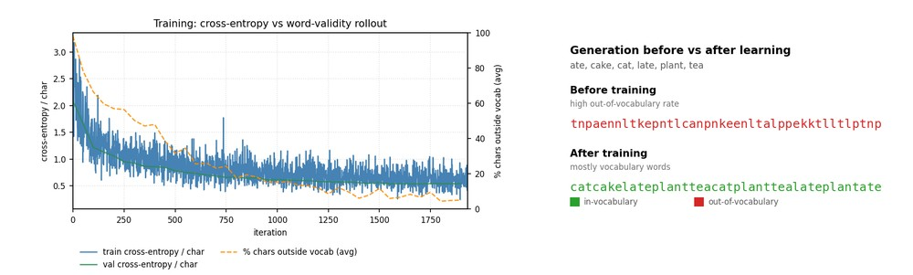

**Figure 1.** Learning curve (left; truncated near the validity plateau) beside stochastic generation before vs after training (right; green = in-vocabulary, red = out-of-vocabulary). Both panels use the same checkpoint and vocabulary (*cat*, *ate*, *tea*, *cake*, *late*, *plant*).

**Figure 2.** Vocabulary and unsegmented training stream.

### 3.2 Next-character probabilities

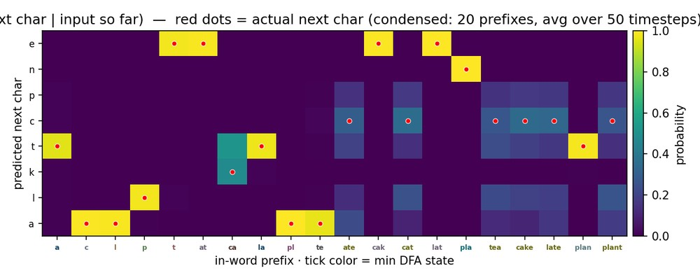

**Figure 3.** Softmax \(P(\text{next char} \mid \text{input so far})\) over unique in-word prefixes (condensed). Probability mass concentrates late in words and spreads at ambiguous prefixes and word boundaries.

### 3.3 Hidden states and clustering

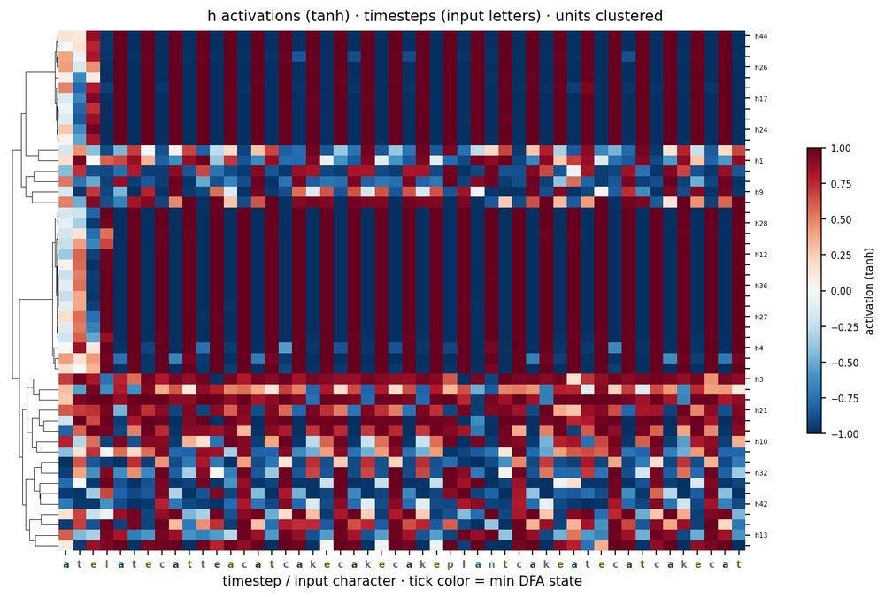

**Figure 4.** Activations over timesteps (x = input letters; units clustered).

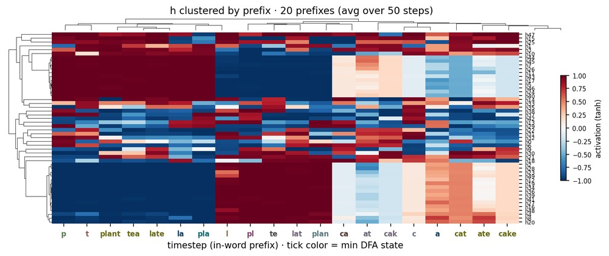

**Figure 5.** Activations clustered by in-word prefix.

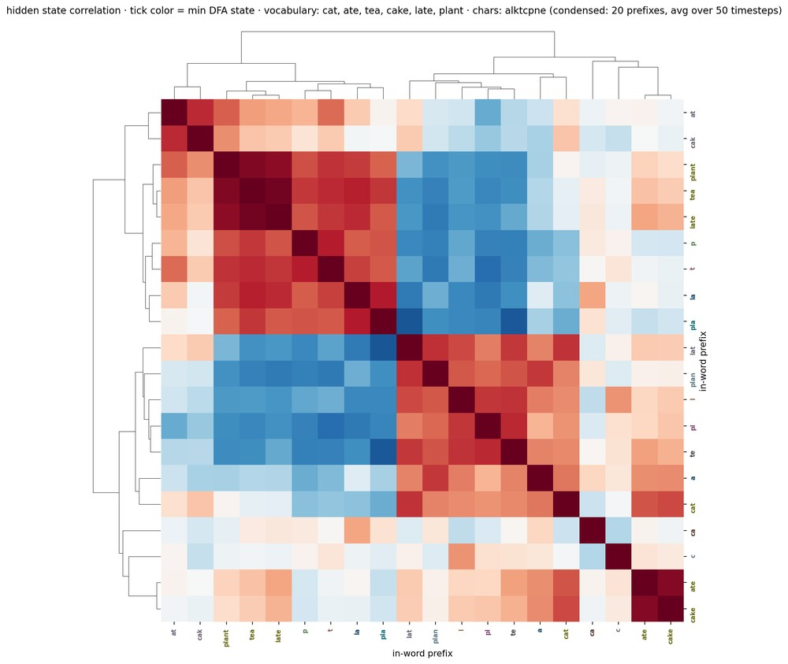

**Figure 6.** Timestep × timestep Pearson correlation of condensed hidden states (hierarchically clustered). Tick labels are in-word prefixes; tick color = minimized DFA state.

### 3.4 DFA geometry and population separation

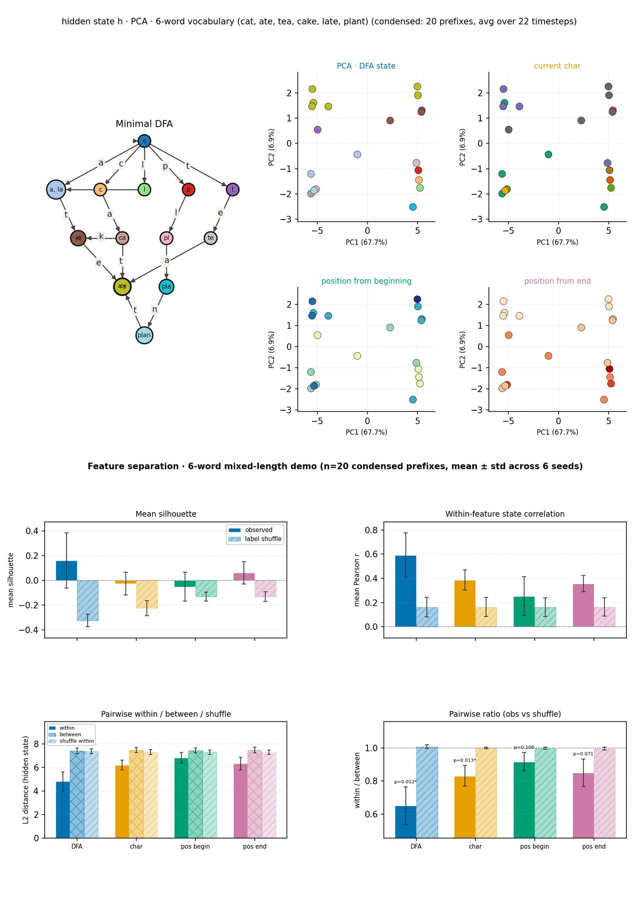

**Figure 7.** Top: minimal DFA for the six-word mixed-length demo (left; larger nodes) with PCA of \(\mathbf{h}\) colored by DFA state, current character, position from beginning, and position from end. Bottom: feature separation on the same demo vocabulary (mean ± std across seeds 1, 2, 3, 5, 7, 8; bars colored by feature). Solid = observed, hatched = label shuffle: mean silhouette, mean within-feature hidden-state correlation, pairwise within/between/shuffle distances, and within/between ratio (with shuffle \(p\) on observed bars).

State colors match between the automaton and the DFA-colored PCA. Mixed word lengths make position-from-end distinct from position-from-beginning. Population \(\eta^2\) ranks DFA highest (\(\approx 0.83\)), then character, position-from-end, and position-from-beginning.

### 3.5 Single-unit selectivity

Per-unit selectivity uses a peak-vs-rest index on category-mean activations (flat units gated to 0). Population median per-unit \(\eta^2\) ranks prefix and DFA highest, then position-from-end / character, with position-from-beginning weaker. Individual units span that spectrum: some are sharply tuned to character or position (including position-from-end); others track DFA state.

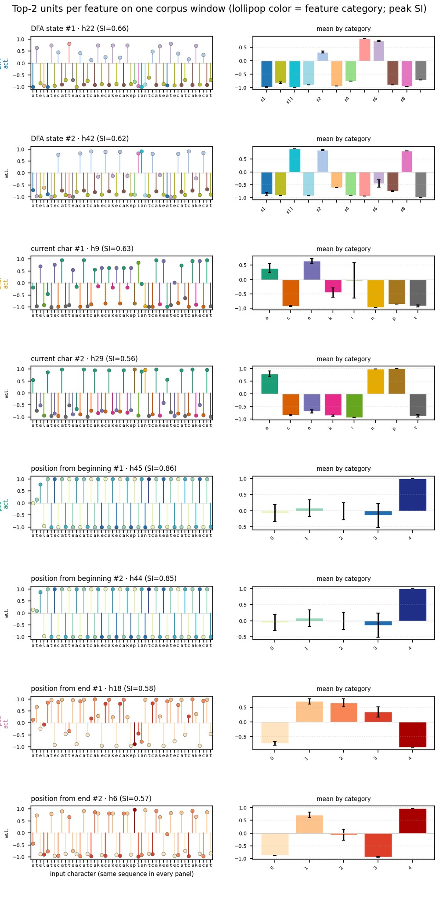

**Figure 8.** Top-2 units per feature (DFA state, character, position from beginning, position from end) on one shared corpus window. Left: activation vs input characters (color = feature category); right: mean activation by category.

### 3.6 Decoding

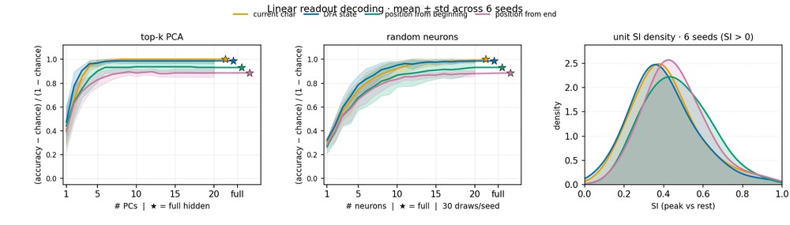

**Figure 9.** Linear decoding, mean ± std across seeds 1, 2, 3, 5, 7, 8 (left / middle), with per-unit selectivity-index density curves pooled over the same seeds on the right (same feature colors). DFA state and current character saturate within a few PCs; position features need more dimensions.

### 3.7 Word trajectories

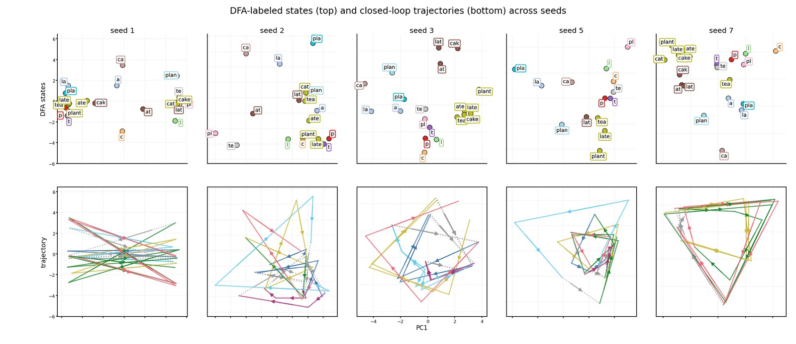

**Figure 10.** Across five training seeds (columns): condensed PCA with prefix labels colored by minimized DFA state (top); closed-loop word trajectories in the same PCA plane (bottom).

### 3.8 Mixed-vocabulary runs scored by DFA size

Instead of a fixed length × word-count grid, we sample mixed English vocabs from length-balanced banks (20 words each of lengths 3–6). Each of 50 runs draws \(n \in \{1,\ldots,25\}\) words at random (\(H{=}100\), seed 1). Final analyses ignore \(n\) and score conditions by minimized vocabulary DFA size (range 4–49).

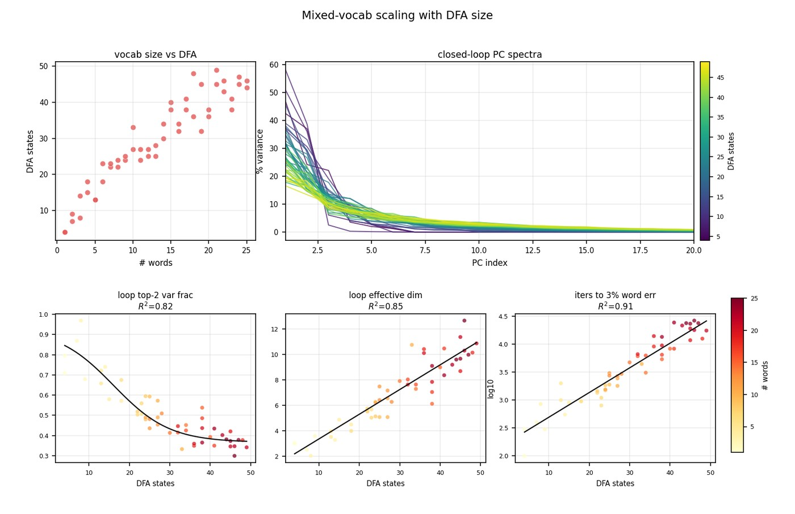

**Figure 11.** Mixed-vocab scaling with minimized DFA size. Top-left: sampled vocabulary size vs DFA state count. Top-right: closed-loop PC spectra colored by DFA size. Bottom: key metrics vs DFA (color = \# words; black = best trend by adjusted \(R^2\)): loop top-2 variance fraction, loop effective dimensionality, and iterations to 3\% word error.

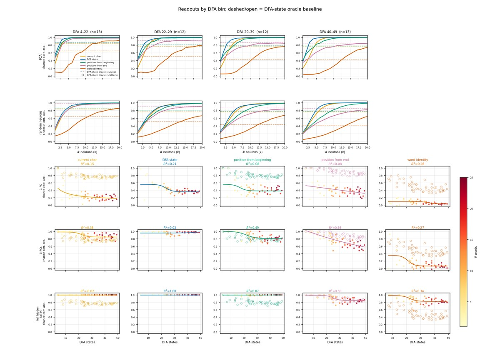

**Figure 12.** Chance-corrected readouts. Top two rows: curves binned by DFA size from top-\(k\) PCA and from random subsets of \(k\) neurons. Bottom three rows: accuracy vs DFA size for each feature using the top 1 PC, top 5 PCs, or the full hidden state (color = \# words).

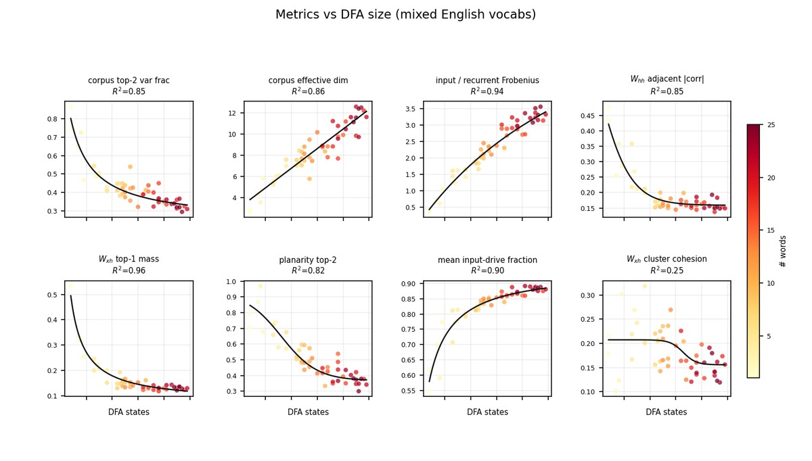

**Figure 13.** Complementary corpus / weight metrics vs minimized DFA size (one point per run; color = \# words; Figure 11 overview metrics and full-hidden decode panels omitted). Black curve = best of linear / sigmoid / exponential-asymptote / hyperbola by adjusted \(R^2\).

### 3.9 Weight structure

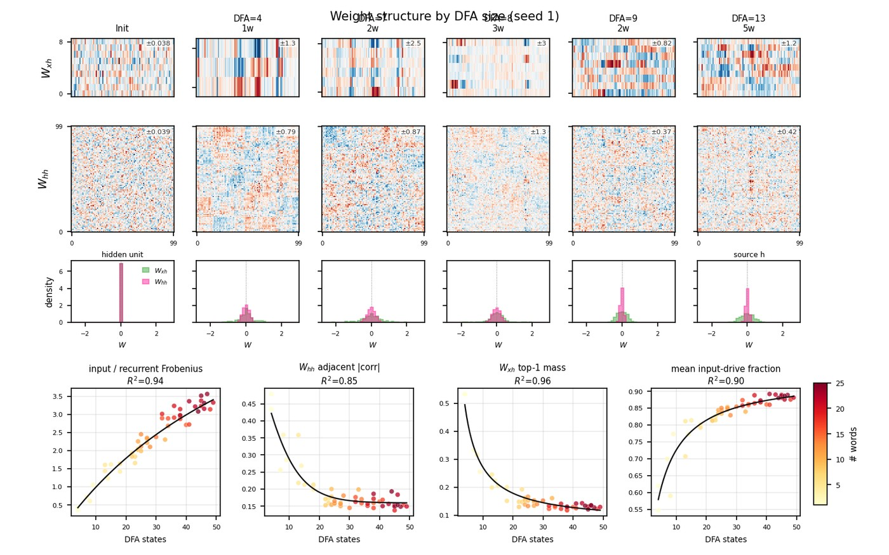

**Figure 14.** Clustered weight matrices from the mixed-vocab runs (\(H{=}100\), seed 1). Left column: one random init for \(W_{xh}\) / \(W_{hh}\). Remaining columns: after learning at the smallest successive minimized DFA sizes (titles also note \#words). Each matrix is color-scaled independently (± inset). Bottom row: density histograms of signed \(W_{xh}\) and \(W_{hh}\) with one shared \(x\)/\(y\) scale across columns.

Easy (few-state) automata show the strongest local \(W_{hh}\) blocks and clearer \(W_{xh}\) letter stripes; larger DFAs yield denser, more feedforward-looking weight maps.

---

## 4. Discussion

Next-character prediction on an unsegmented finite lexicon yields DFA-aligned hidden geometry. The six-word mixed-length demo makes the task transparent: activations and state correlations cluster by prefix and automaton state; population separation and multi-seed decoding show that automaton state is low-dimensional and stable; trajectories form labeled geometric motifs that recur across training seeds. Fifty mixed-length English vocab runs (\(H{=}100\)) make the scaling claim concrete without fixing length or word count: hidden dimensionality, training iterations, and readout of position-from-end track minimized DFA size—so the network’s geometry expands when the word automaton expands. Weight analyses on that same sweep (Figure 14) show letter-columnar input weights and locally clumped recurrent connectivity, clearest for small DFAs.

**Limits.** Toy character languages; \(H = 50\) for the demo analyses (\(H{=}100\) in the mixed-vocab runs); small seed counts for grids; no acoustic noise. The model is a hypothesis generator, not a claim that infants are Elman networks.

**Supplementary (omitted from main text).** Prefix-labeled PCA overview; within-/between-DFA distance panels; next-character decision-region / per-character readout heatmaps; activations grouped by input character; DFA-grouped correlation heatmaps; per-seed decoding panels with trajectory insets; older length × word-count metric heatmaps; 16-word equal-length condition used in earlier drafts.

---

## 5. Conclusion

Small next-character RNNs discover word structure in unsegmented streams. States cluster by prefix and DFA identity; decoding recovers that structure across seeds; across mixed-length English vocabs, larger minimized DFAs yield higher-dimensional closed-loop geometry, slower word-error acquisition, and weaker position-from-end readout, while weight matrices develop letter-columnar \(W_{xh}\) and locally clumped \(W_{hh}\).

---

## References

Aslin, R. N., Saffran, J. R., & Newport, E. L. (1998). *Psychological Science, 9*(4), 321–324.

Elman, J. L. (1990). Finding structure in time. *Cognitive Science, 14*(2), 179–211.

Frank, M. C., Goldwater, S., Griffiths, T. L., & Tenenbaum, J. B. (2010). *Cognition, 117*(2), 107–125.

French, R. M., Addyman, C., & Mareschal, D. (2011). TRACX. *Psychological Review, 118*(4), 614–636.

Goldwater, S., Griffiths, T. L., & Johnson, M. (2009). *Cognition, 112*(1), 21–54.

Perruchet, P., & Vinter, A. (1998). PARSER. *Journal of Memory and Language, 39*(2), 246–263.

Saffran, J. R., Aslin, R. N., & Newport, E. L. (1996). *Science, 274*(5294), 1926–1928.
