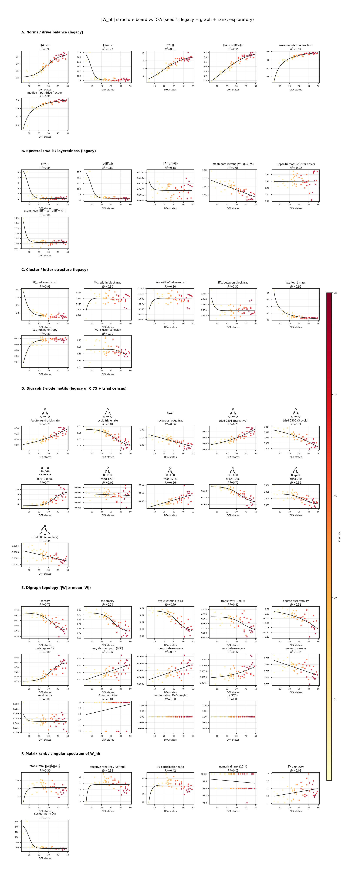
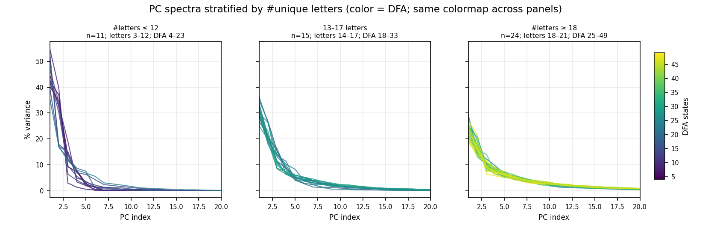
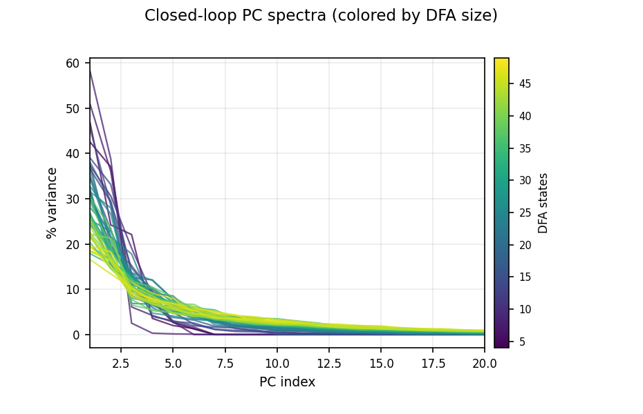
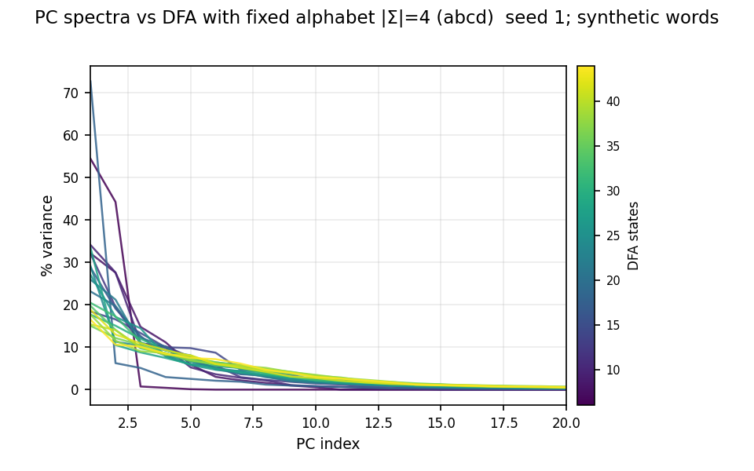

# Lab notebook — 2026-07-18

Session focus: **what drives PC-spectrum flattening with DFA size?** Weight-graph structure on the mixed sweep, then a fixed-alphabet control.

---

## 1. Weight / graph metrics on mixed DFA (exploratory)

**Question.** Does trained recurrence look more “layered” / less cyclic as minimized DFA grows? Can standard graph metrics on \(W_{hh}\) add something beyond Frobenius / letter proxies?

**Setup.** Existing `mixed_vocab_dfa_ns` runs. Thresholded \(|W_{hh}|\) digraph (+ signed motifs), input-side norms, letter-clump / rank metrics.

**Entry.** `scripts/mixed_dfa_sweep.py weight-layeredness`  
**Code.** `viz/weight_structure.py`, sections in `viz/compare/mixed_dfa_viz.py`

**Artifacts.**
- data: `experiments/comparisons/mixed_vocab_dfa_ns/data/mixed_dfa_weight_graph_metrics.json`



**Results (qualitative).**
- Higher DFA → **stronger input drive** \(\|W_{xh}\|_F\) roughly ~13 → ~25; **softer letter clumps**; digraph **less cyclic / more feedforward**.
- Signed polarity roughly flat; condensation height / single-SCC picture does **not** look like a deep layered DAG.
- Motif schematics (unsigned + signed) retained above section panels; redundant / constant / alias panels pruned.

**Interpretation (open).**
- Rejected as primary story: “more info ⇒ more drive,” residual confounds alone, or “mostly quieter recurrence.”
- Solid empirical bit: input Frobenius grows; top-1 letter mass falls (stronger but muddier input). Mechanism still unclear.

---

## 2. Post-hoc: PC spectra binned by letter count

**Question.** Is spectrum flattening just alphabet growth co-varying with DFA?

**Setup.** Re-slice existing mixed runs by \(n\) letters (alphabet still tracks DFA — imperfect control).

**Entry.** `scripts/mixed_dfa_sweep.py spectra-by-letters`

**Artifact.**



**Result.** Suggestive but confounded — need a real fixed-\(|\Sigma|\) experiment.

---

## 3. Control: fixed alphabet, vary DFA (synthetic)

**Question.** Holding \(|\Sigma|\) fixed, do PC spectra still track DFA size?

**Setup.**
- Alphabet fixed: `abcd` (\(|\Sigma|=4\)).
- 20 synthetic vocabs, DFA targets 6…44 (all use all 4 letters).
- Comparison: `fixed_letters_dfa_ns`; tasks `fixlettdfa_rXX_ns`.
- Vocab builder: `vocab_fixed_letters_dfa.py` (wired via lazy registration in `task.py` / `experiment.py`).
- CLI: `scripts/fixed_letters_dfa_sweep.py` (`plan | train | collect | plot | all`).

**Training.** 20/20 checkpoints (`model_seed1.npz`). Several runs plateau above ~3% word error but still saved. Earlier parallel train failed (Windows/console worker); rerun succeeded.

**Artifacts.**
- data: `experiments/comparisons/fixed_letters_dfa_ns/data/fixed_letters_dfa_panels.json`

Baseline mixed sweep (alphabet free to co-vary with DFA):



Fixed alphabet \(|\Sigma|=4\):



**Results.**
- Same qualitative story as the mixed sweep: low DFA → sharp spectrum (~70% on PC1); high DFA → flatter (~15–20% on PC1, mass pushed into later PCs).
- **Consequence:** alphabet growth is **not** necessary for spectrum flattening with DFA size. Dimensionality tracks grammatical complexity under fixed \(|\Sigma|\).

---

## Takeaways

| Claim | Status |
| --- | --- |
| PC spectra flatten as DFA grows | Replicated (mixed + fixed-\(\Sigma\)) |
| Effect caused by larger alphabets | **Ruled out** (control §3) |
| Higher DFA ⇒ deeper layered \(W_{hh}\) DAG | **Not supported** (graph metrics §1) |
| Higher DFA ⇒ stronger / muddier input (\(W_{xh}\)) | Supported correlatively; mechanism open |
| Weight graph “why” for spectra | Still open |

**Not yet:** paper-draft writeup / figure sync for the fixed-letter control; multi-seed fixed-letter; disentangling word count / length from DFA within fixed \(\Sigma\).

---

## Commands (canonical)

```text
python scripts/mixed_dfa_sweep.py weight-layeredness
python scripts/mixed_dfa_sweep.py spectra-by-letters
python scripts/fixed_letters_dfa_sweep.py plan
python scripts/fixed_letters_dfa_sweep.py train --jobs 2
python scripts/fixed_letters_dfa_sweep.py plot
```
