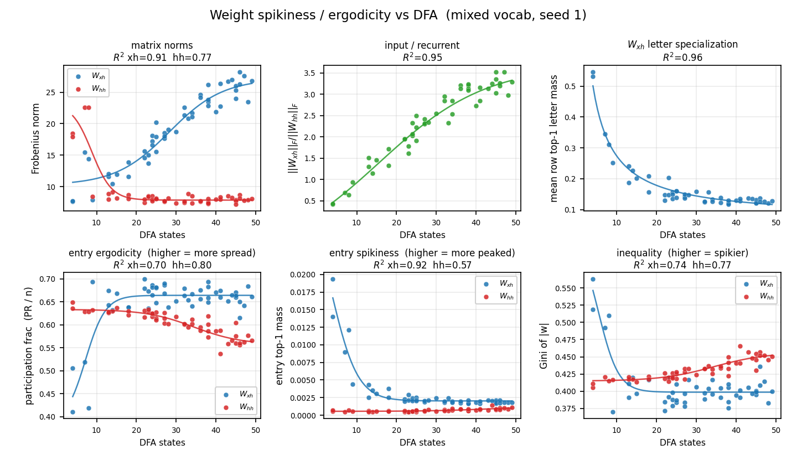
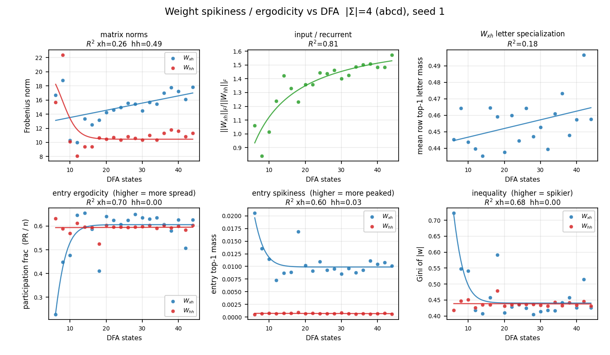
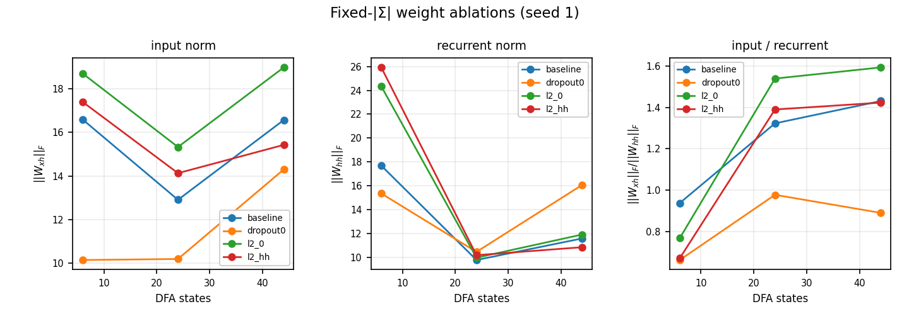
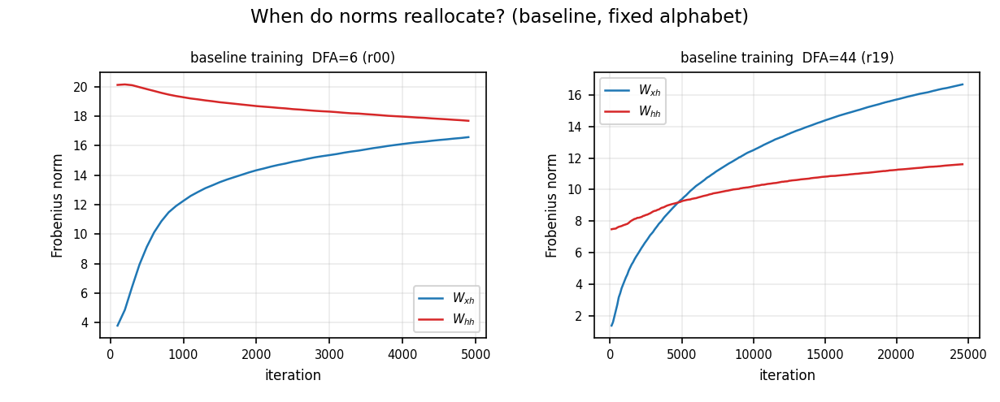

# Lab notebook — 2026-07-19

Session focus: **entrywise spikiness / ergodicity of \(W_{xh}\) vs \(W_{hh}\)** as DFA grows (why input norms reallocate).

---

## Setup

Same trained checkpoints as before. New metrics on flattened \(|W|\):

- **participation frac** \(= \mathrm{PR}/n\) — higher ⇒ more ergodic / spread
- **entry top-1 mass** — higher ⇒ spikier
- **Gini of \(|w|\)** — higher ⇒ spikier

Plus Frobenius norms and letter-wise \(W_{xh}\) top-1 (row specialization over characters).

**CLI.** `python scripts/mixed_dfa_sweep.py weight-spikiness`  
`python scripts/fixed_letters_dfa_sweep.py weight-spikiness`

---

## Mixed vocab

**Norms (known):** Win↑ (~12→26), Whh↓ then flat (~9→8), ratio ↑ strongly.

**Spikiness:**
- \(W_{xh}\): becomes **more ergodic** with DFA (PR frac up; entry top-1 and Gini down). Letter specialization also collapses (~0.23→0.13).
- \(W_{hh}\): does **not** delocalize the same way — PR frac **falls** with DFA (r≈−0.87), Gini **rises** (slightly spikier) while overall norm stays small.

So the delocalization is an **input** story; recurrence gets quieter and, if anything, a bit more peaked.

---

## Fixed alphabet \(|\Sigma|=4\)

Same qualitative pattern without alphabet growth:

- Win↑ / Whh drop-then-plateau; ratio ↑ (R²≈0.81).
- \(W_{xh}\) entry ergodicity ↑ strongly at low→mid DFA then plateaus near hh (~0.6); Gini and entry top-1 fall.
- \(W_{hh}\) spikiness metrics **flat** across DFA (R²≈0).
- Letter top-1 mass barely moves (already ~0.44–0.46 with only 4 letters) — muddiness here is **entrywise**, not letter-specialization.

---

## Consequence (spikiness alone)

Useful description: with more DFA, \(W_{xh}\) **changes shape** (spreads), not just scale; \(W_{hh}\) does not mirror that.  
Does **not** by itself explain why \(\|W_{xh}\|\) grows (columns are context-blind; spreading ≠ forced Frobenius growth).

---

## Ablations (fixed \(|\Sigma|\), DFA ∈ {6,24,44})

Conditions: **baseline** (dropout 0.25, L2 all), **dropout0**, **l2_0**, **l2_hh** (L2 only on \(W_{hh}\)).

CLI: `python scripts/fixed_letters_dfa_sweep.py ablate-weights`

| cond | dfa | WinF | WhhF | ratio |
| --- | ---: | ---: | ---: | ---: |
| baseline | 6 | 16.6 | 17.7 | 0.94 |
| baseline | 24 | 12.9 | 9.8 | 1.32 |
| baseline | 44 | 16.6 | 11.6 | 1.43 |
| dropout0 | 6 | 10.2 | 15.4 | 0.66 |
| dropout0 | 24 | 10.2 | 10.4 | 0.98 |
| dropout0 | 44 | 14.3 | 16.1 | 0.89 |
| l2_0 | 6 | 18.7 | 24.3 | 0.77 |
| l2_0 | 24 | 15.3 | 10.0 | 1.54 |
| l2_0 | 44 | 19.0 | 11.9 | 1.59 |
| l2_hh | 6 | 17.4 | 25.9 | 0.67 |
| l2_hh | 24 | 14.1 | 10.2 | 1.39 |
| l2_hh | 44 | 15.4 | 10.8 | 1.42 |

### What this rules in / out

1. **Hidden dropout is a major enabler of input-dominated solutions.**  
   With dropout=0, ratio stays ≤1 across DFA; at DFA=44, \(W_{hh}\) stays large (~16 vs ~12 baseline). Removing dropout largely kills the “input takes over” pattern.

2. **Shared L2 is not the cause.**  
   `l2_0` still shows ratio rising with DFA (even more so). So this is not “L2 shoves mass onto \(W_{xh}\) because one-hot is cheaper.”

3. **L2-only-on-\(W_{hh}\)` ≈ baseline** at mid/high DFA for the ratio — selective recurrent L2 doesn’t invent the effect.

4. **Raw \(\|W_{xh}\|\) vs DFA is not monotonic** here (V-shape on 3 points). The robust axis is **ratio / quieter mid-DFA \(W_{hh}\)**, not “Win always grows.”

5. **Dynamics (baseline):** at DFA=44, both norms rise; \(W_{xh}\) grows faster and crosses \(W_{hh}\) — not “\(W_{hh}\) dies first, then Win compensates.” At DFA=6, \(W_{hh}\) drifts down while Win climbs but stays below.

### Current best account (cautious)

Task complexity still matters (Whh drops low→mid DFA in almost every cond), but the **input-heavy end state is strongly dropout-dependent**. Dropout makes recurrence unreliable in training → optimizer leans on instantaneous input. Without that crutch, high-DFA nets keep stronger recurrence.

Still open: why Whh drops low→mid even with dropout=0 (partially does: 15→10); multi-seed; whether CE difficulty / letter-reuse predicts residual Win changes.

---

## Artifacts

- [mixed spikiness](../../experiments/comparisons/mixed_vocab_dfa_ns/trajectories/weight_spikiness_vs_dfa.png)
- [fixed-letter spikiness](../../experiments/comparisons/fixed_letters_dfa_ns/trajectories/weight_spikiness_vs_dfa.png)
- [ablation board](../../experiments/comparisons/fixed_letters_dfa_ns/trajectories/weight_ablation_fixed_letters.png)
- [norm dynamics](../../experiments/comparisons/fixed_letters_dfa_ns/trajectories/weight_norm_dynamics_fixed_letters.png)
- data: `.../data/weight_spikiness_vs_dfa.json`, `.../data/weight_ablation_fixed_letters.json`
