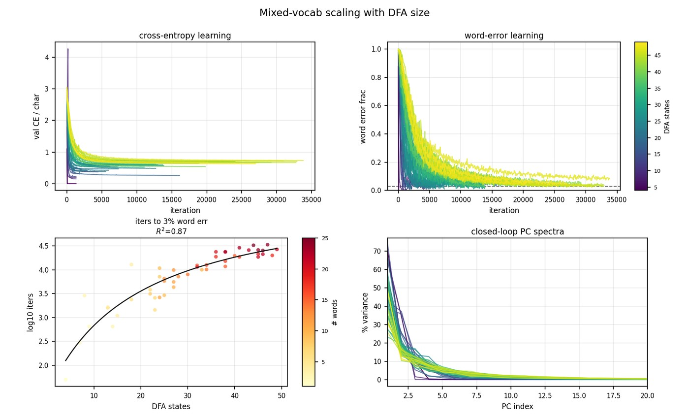

# 2026-08-09

## Session — Dale resume + Fig 12 CE spike

### Questions
- Finish Dale home resume (plots without learning-decode PCA snaps).
- Why does Fig 12 CE panel blow up? Can we fix by redoing the run (no ylim patches)?

### Experiments / controls
- Dale mixed plot suite with `--skip-learning-decode`.
- Retrain `mixeddfa_r01_ns` (`can`, DFA=4): seed 1 is a **deterministic** CE spike (~18 at iter 1100, ~15 at 1250); seed 2 is clean (max CE ≈ 1.1 at init).
- Installed seed-2 weights/history as the analysis `model_seed1.npz` for this run (unstable seed-1 kept as `model_seed1_unstable.npz` / `model_seed1_learning_unstable/`).

### Results
- Fig 12 CE ylim now ~0–3; no outlier spike.
- Also refreshed r01 panel, metric board, training-vs-DFA, weight matrices, trajectory grid; paper collect synced.

### Consequences
- Seed 1 on this 1-word Dale vocab is unstable mid-training; do not trust that init for learning curves.
- Learning-decode still skipped (optional later).

### Artifacts


### Canonical commands
```powershell
python scripts/train_dale_paper.py --mixed --run-ids 1 --seeds 2 --force
python scripts/mixed_dfa_sweep.py plot --model-type rnn_dale --seeds 1 --replot-only --skip-learning-decode
python scripts/paper_collect_figures.py
```
