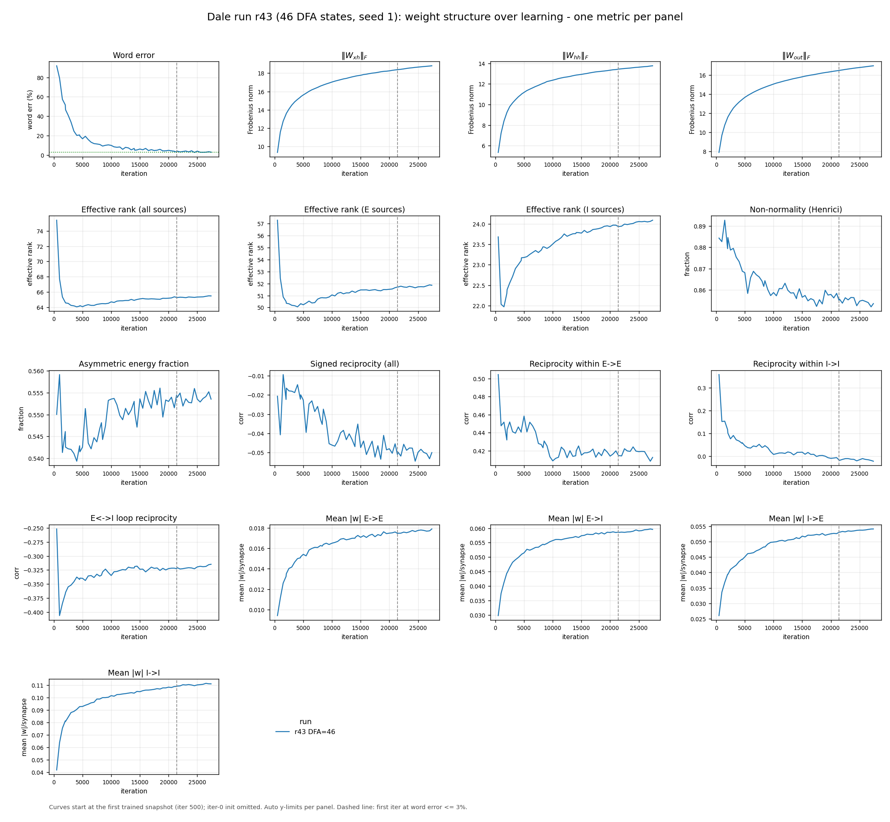
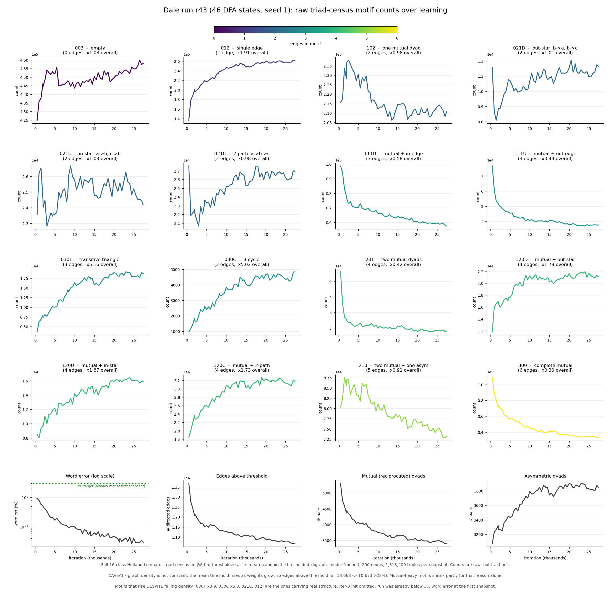
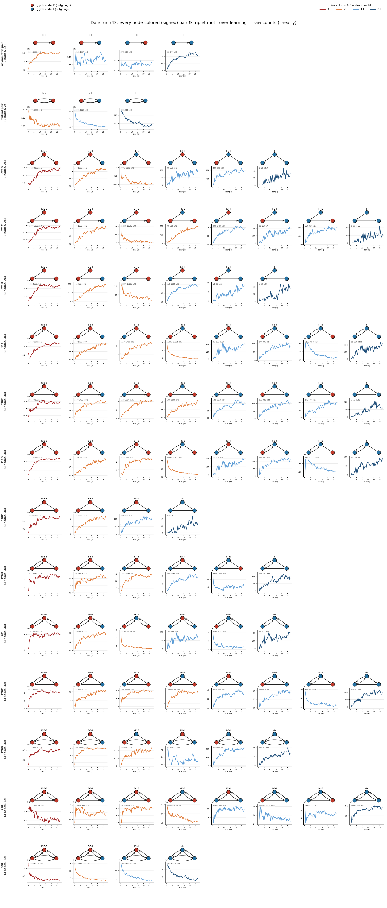
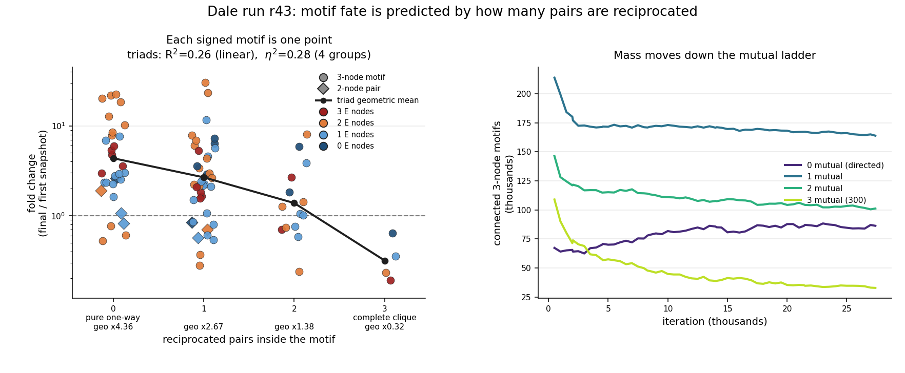
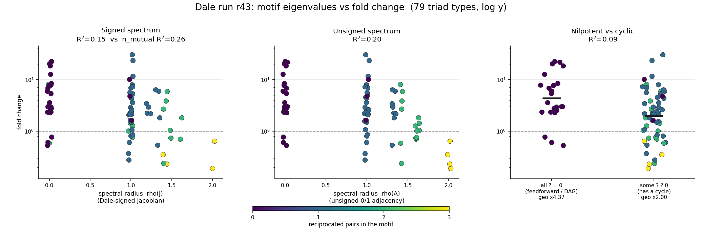
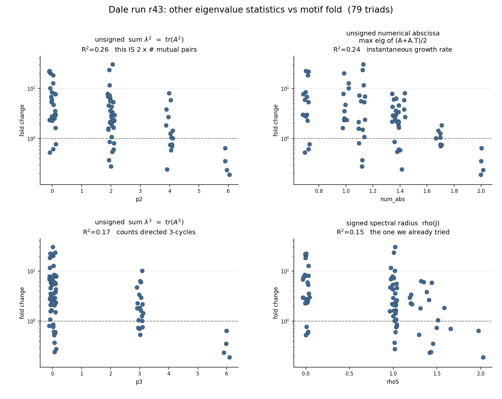

# 2026-08-17

## Session — Dale r43 weight dynamics, signed motifs, reciprocity theory

Single Dale mixed-vocab run **r43** (46 DFA states, seed 1, 160 E / 40 I, H=200). Snapshots from the dominant training session only (stale files from an earlier overwrite in the same directory dropped via mtime gap > 1 h). Iter-0 random init omitted from curves. Graph = `|W_hh|` thresholded at its mean.

`W_hh[i,j]` is the synapse **j→i** (`h[t] = f(W_hh @ h[t-1])`). Dale sign is per **column** (outgoing). Analyses below use true synaptic orientation (`adjacency = W_hh.T`). The repo's canonical `_thresholded_digraph` still feeds `W_hh` untransposed, which swaps D/U triad labels (`021D↔021U`, `111D↔111U`, `120D↔120U`); the other 10 Holland–Leinhardt classes are transpose-invariant.

### Questions
- How do weight-structure metrics (norms, rank, reciprocity, E/I block means) change over learning?
- What is reciprocity, and why can magnitudes rise while it falls?
- Is there a well-defined triplet analog of dyad reciprocity?
- How do **counts** of 2-node and 3-node motifs evolve (including bidirectional / mutual triads, not just FF + cycle)?
- Signed motif = a **node coloring** (E red / I blue), not a grey glyph with a split line.
- Is there a general rule for which signed motifs rise vs fall?
- Do motif **eigenvalues** predict fold better than `#` of reciprocated pairs?

### Experiments / controls
- r43 dominant-session learning snaps (`iter_500` … `iter_27400`, n=60 trained checkpoints).
- Motif census: full 16-class Holland–Leinhardt on the mean-thresholded digraph; then node-colored isomorphism classes (7 pair colorings + 86 triad colorings = 93 signed motifs).
- Canonical typed census `compute_weight_digraph_motifs_by_ei` for the 8 FF + 8 cycle colorings (cycle counts use the repo's ×3 rotation convention).
- Added the 9 missing triad schemas (`003,012,102,021D/U/C,111D/U,201`) to `_MOTIF_SCHEMA_EDGES` in `viz/weight_structure.py`, each checked against `nx.triadic_census`.
- Fold-change analysis: signed motifs with ≥20 instances at the first trained snapshot (79 triads, 7 pairs).
- Eigenvalue battery on each 3×3 unsigned adjacency `A` and Dale-signed Jacobian `J[post,pre]=sign(pre)`.

### Results

**Reciprocity is a correlation, not a magnitude.** `corr(W_ij, W_ji)` equals `(var(sym)−var(anti))/(var(sym)+var(anti))` to 4 decimals and is scale-free (`corr(W)=corr(10W)`). In r43, `|W|` grows in every E/I block while whole-matrix reciprocity drifts −0.02 → −0.05 because antisymmetric energy grows slightly faster. Pooled reciprocity is a cancellation: E→E sits near +0.41, E↔I loops near −0.31.

**Clockwise vs counterclockwise cycle-product correlation is not a triplet statistic.** Under Dale, `sign(CW)=sign(CCW)` always (same presynaptic multiset). CW vs CCW uses exactly the three reverse edges of the same dyads; row-shuffle (kills i↔j pairing, keeps Dale signs and row norms) collapses it in lockstep with dyad reciprocity. Cycle *imbalance* `mean(CW−CCW)` flips sign under relabeling — discarded.

**Weight-structure over learning (one metric per panel):** norms jump early then creep; E→E reciprocity stays high; E↔I loop reciprocity stays negative.

**Unsigned triad counts:** density is not constant (edges above threshold 13,668 → 10,673, −22%). Mutual-rich classes fall (`300` ×0.30, `201` ×0.42). Pure directed triangles rise against that (`030T` ×5.16, `030C` ×5.02). Transitive/cyclic *ratio* barely moves (3.75 → 3.86). Mutual dyads 5,300 → 3,450; asymmetric dyads 3,100 → 3,850.

**Signed = node coloring.** 93 panels: 2 pair rows + 13 connected triad topologies (including every bidirectional class: `111, 120, 201, 210, 300`). E subnetwork sparse/directed; I subnetwork dense/mutual (`300` is ~52% of all-I triples at the end). All-E `300` craters 15,839 → 3,007; all-I `300` barely moves.

**Theory: motif fate ≈ how many pairs inside it are reciprocated.**

| mutual dyads in the triad | geo fold |
|---|---|
| 0 (pure one-way) | ×4.36 |
| 1 | ×2.67 |
| 2 | ×1.38 |
| 3 (`300`) | ×0.32 |

Pairs: every asymmetric coloring flat or up; every mutual coloring down. `#` E nodes does **not** predict direction (R² ≈ 0 on log-fold after `n_mutual`).

Variance on 79 triads, `log(fold)`:
- `n_mutual` linear **R² = 0.26**, ANOVA **η² = 0.28**, Spearman ρ = −0.45
- each extra mutual dyad multiplies geo-mean fold by ~×0.50
- leftover 72% is within-bin scatter (SD of log-fold ≈ 1)

Connected-triple mass: 0-mutual +19k; 1/2/3-mutual lose; total connected triples 536k → 384k (−28%, graph getting sparser). Not a closed conversion.

**Eigenvalues.** Spectral radius is the wrong scalar (lumps 3-cycles with mutual dyads: both have ρ=1, but 030C rises). Best eigenvalue statistic is **∑λ² = tr(A²)**, which equals `2 × n_mutual` exactly. Nothing else in the spectrum beats it.

| metric | R² |
|---|---|
| ∑λ² = tr(A²) = 2 n_mutual | 0.26 |
| numerical abscissa of A | 0.24 |
| unsigned ρ(A) / abscissa | 0.20 |
| ∑λ³ = tr(A³) (3-cycles) | 0.17 |
| signed ρ(J) | 0.15 |
| nilpotent vs not | 0.09 |
| n_mutual + ρ + Im + non-normality | 0.27 |

Nilpotent / DAG motifs (all λ=0): geo ×4.37. Has a cycle: geo ×2.00. Complete EEE clique is the extreme: λ=(2,−1,−1), fold ×0.19. Signed `tr(J²)` ≈ 0 correlation (Dale signs cancel EE ±1 vs EI ±i).

### Consequences
- Report **block-level** reciprocity, not the pooled matrix number.
- Do not use CW/CCW cycle-product correlation as a triad analog of reciprocity.
- “Triplet” = 3 nodes, all connected topologies, including bidirectional; not FF+cycle only.
- Working description of learning on this Dale run: thresholded graph converts echo (`i↔j`) into one-way flow. Computational reading (DFA wants order) and threshold bookkeeping (weaker reverse drops below a rising mean cutoff) are both compatible; not separated here.
- Prefer `#` reciprocated pairs (or equivalently ∑λ² of the unsigned motif) over spectral radius.
- Canonical `_thresholded_digraph` orientation vs true `W_hh.T` is still unresolved; D/U labels in older motif boards may be swapped.

### Artifacts
- `experiments/comparisons/mixed_vocab_dfa_ns/trajectories/r43_weight_dynamics_panels.png`
- `experiments/comparisons/mixed_vocab_dfa_ns/trajectories/r43_motif_counts_over_learning.png` (+ `.json`)
- `experiments/comparisons/mixed_vocab_dfa_ns/trajectories/r43_motif_counts_signed.png` (+ `.json`)
- `experiments/comparisons/mixed_vocab_dfa_ns/trajectories/r43_motif_signed_typed.png` (+ `r43_motif_typed.json`)
- `experiments/comparisons/mixed_vocab_dfa_ns/trajectories/r43_motif_signed_all.png` (+ `r43_motif_colored_all.json`)
- `experiments/comparisons/mixed_vocab_dfa_ns/trajectories/r43_motif_fold_vs_mutual.png`
- `experiments/comparisons/mixed_vocab_dfa_ns/trajectories/r43_motif_fold_vs_spectrum.png`
- `experiments/comparisons/mixed_vocab_dfa_ns/trajectories/r43_motif_fold_vs_eigs_battery.png`

### Canonical commands
Census and plots were computed from r43 `model_seed1_learning` snapshots with `viz.weight_structure._thresholded_digraph` / `compute_weight_digraph_motifs_by_ei` / `draw_digraph_motif_schema` (no ad-hoc regen entrypoint; analysis run in-session).
