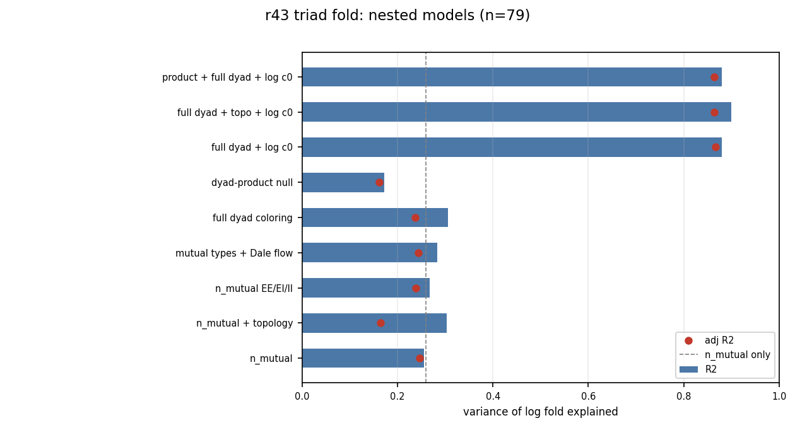
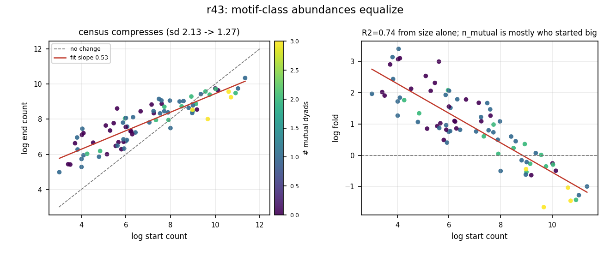
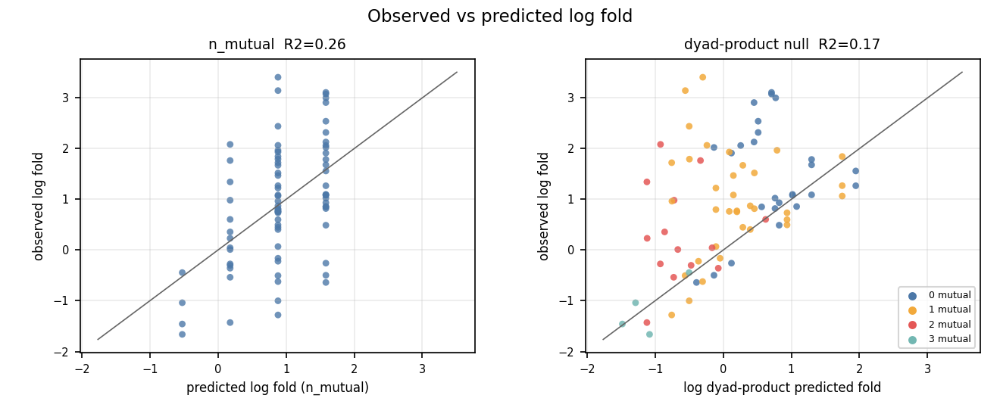
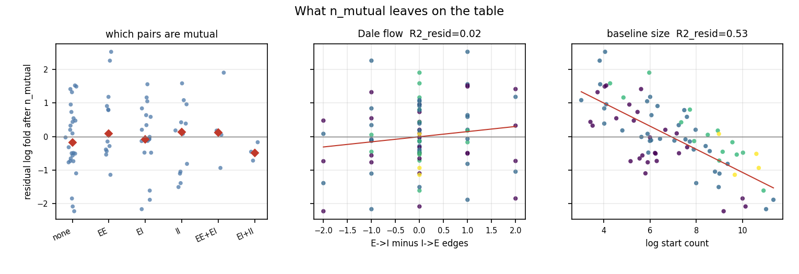
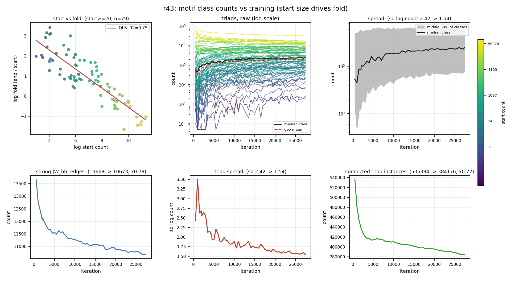

# 2026-08-18

## Session — r43 triad fold: n_mutual is not enough

Follow-up to [2026-08-17](2026-08-17.md). Same census: 79 signed triads with >=20 instances at the first trained snapshot (dominant r43 session, 60 snaps, iter 500–27400). Target = log(fold) of raw counts (start → end).

### Questions
- What explains the ~74% of log-fold variance left after `n_mutual` (R² = 0.26)?
- Is it Dale coloring, topology, a dyad-product null, or global sparsification (−28% connected triples)?
- When we plot every class over training, do counts actually bunch toward a common level?

### Experiments / controls
- Nested OLS on 79 triads: `n_mutual`; mutual-pair coloring (EE/EI/II); Dale flow (#E→I − #I→E); full 7 dyad-coloring counts; Holland–Leinhardt topology one-hots; log start count; dyad-product predicted fold (product of observed dyad-type folds).
- Same models on **share** fold (count / connected triples) to kill global density change.
- `log c1 ~ log c0` compression check; residual plots after `n_mutual`.
- Raw per-class count trajectories from `r43_motif_colored_all.json`.

### Results

**Structure labels barely move the needle once start size is in.** Splitting mutual pairs by EE/EI/II, adding Dale flow, topology, or all seven dyad colors: adj R² stays ~0.16–0.26. Dyad-product null (triad fold ≈ product of its three dyad-type folds) is worse (R² = 0.17). Triads are not independent products of pairwise changes.

**Starting abundance is the main predictor.** `log c0` alone: R² ≈ 0.74. `n_mutual + log c0`: R² ≈ 0.88. `n_mutual` mostly tags who started big (corr with log c0 ≈ 0.47); after controlling for start size it adds ~4%.

**What the census is doing:** abundances **equalize partially**, not fully. sd(log count) 2.13 → 1.27 on the 79 triads; full 84-class sd 2.42 → 1.54. Fit `log c1 ≈ 4.18 + 0.53 log c0` (R² = 0.78). Rare directed colorings explode; common mutual-rich classes shrink. Connected-triple mass −28%, but share-fold still leaves most variance — not purely “graph got smaller.”

**Leftover mutual split is real but small:** at 1 mutual, geo fold EE ×4.66 vs EI ×2.44 vs II ×1.96.









### Consequences (morning)
- Do **not** treat `n_mutual` (or tr(A²)) as the explanation of triad fold; it is a weak proxy for “started common.”
- Paper language: **census compression / partial equalization** — common types fall, rare types rise, band tightens — not “all motifs → one count.”
- Open: why slope ~0.53 on log scale; size-matching or confound-model residual.

---

## Session — raw counts board + global budget panels

Same r43 census. Built canonical figure entrypoint `scripts/r43_motif_figs.py` (replaces in-session temp scripts).

### Questions
- Visually: does learning homogenize motif counts over time?
- Is spread compression just the graph shrinking, or rebalancing within a sparser graph?
- “Random should be typical” — does training return to a random motif histogram?

### Experiments / controls
- 2×3 figure: (top) start vs log-fold scatter | log-scale triad trajectories | IQR spread band; (bottom) strong |W_hh| edge count | sd(log triad count) | total connected triad instances.
- Scatter: 79 triads with start ≥ 20; colors = start count (viridis).
- Edge totals from `r43_motif_counts_over_learning.json` (`edges` field, same 60-iter grid).

### Results

**Homogenization is robust and visible.** Yellow (high-start) classes fall; purple (low-start) rise; middle 50% band narrows. Scatter: log start vs log fold **R² = 0.75**. Not all classes land on one count — biggest 84k → 31k, smallest 1 → 18 at session end.

**Global density falls, but spread falls faster.** Strong edges 13,668 → 10,673 (×0.78). Connected triad instances 536,384 → 384,176 (×0.72). sd(log count) 2.42 → 1.54. Uniform rescaling by 0.72 would **not** change sd(log count); the drop is real rebalancing, not pure scale shrink.

**“Random = typical” is the wrong object.** Random **weights** ≠ uniform over **motif labels**. Thresholded |W_hh| + Dale coloring is a nonlinear census; even i.i.d. init is wildly skewed in motif space. Training does not re-randomize — weights grow, task-structure enters, threshold moves. “Typical” here means **less extreme than the init draw** (compression toward a narrower band), not fresh Gaussian init.

**Simple processes that fit:** log-scale shrinkage toward a common level (`log c_end ≈ a + b log c_start`, b < 1); soft edge-budget redistribution; multiplicative weight growth + threshold census. All give “common shrink / rare grow” without motif-specific rules.



### Consequences (end of day)
- r43 motif story for the paper: **partial homogenization driven by starting abundance**; mutual count is a tag, not a mechanism.
- Global sparsification is real but does not explain away the fold–start correlation (share-fold controls still leave structure; start size dominates).
- Next if needed: compare trained histogram to **fresh random init at matched** |W| scale / edge count (fair null); check whether slope 0.53 persists across other Dale runs.

### Artifacts
- `experiments/comparisons/mixed_vocab_dfa_ns/trajectories/r43_motif_fold_nested_r2.png` (+ `.json`)
- `experiments/comparisons/mixed_vocab_dfa_ns/trajectories/r43_motif_fold_equalization.png`
- `experiments/comparisons/mixed_vocab_dfa_ns/trajectories/r43_motif_fold_obs_vs_pred.png`
- `experiments/comparisons/mixed_vocab_dfa_ns/trajectories/r43_motif_fold_residual.png`
- `experiments/comparisons/mixed_vocab_dfa_ns/trajectories/r43_motif_counts_raw_over_learning.png`
- `experiments/comparisons/mixed_vocab_dfa_ns/trajectories/r43_motif_colored_all.json`
- `experiments/comparisons/mixed_vocab_dfa_ns/trajectories/r43_motif_counts_over_learning.json`

### Canonical commands
```bash
python scripts/r43_motif_figs.py
python scripts/r43_motif_figs.py --only raw-over-learning
```

Nested-model figures were computed in-session from `r43_motif_colored_all.json` (no separate CLI yet).