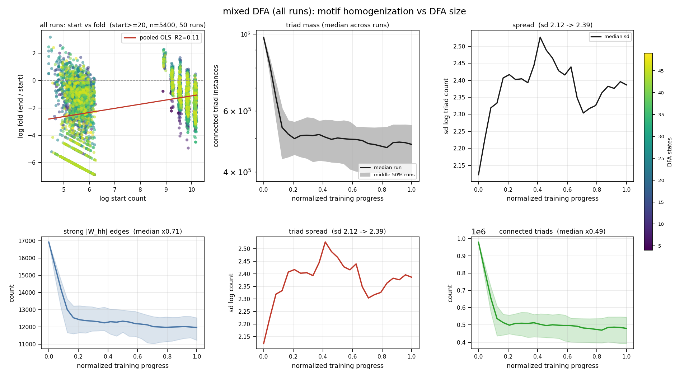
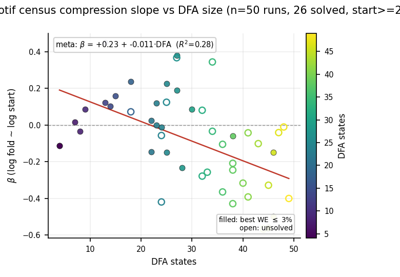

# 2026-08-19

## Session — all-runs motif board, H300 Dale recipe, solve rate

Follow-up to [2026-08-18](2026-08-18.md).

### Questions
- Is “big motifs shrink, small motifs grow” a **general** Dale learning law, or run-specific?
- Does compression slope (β) track DFA size when every run is shown?
- Can we get **all 50** mixed-DFA runs to ≤3% WE with more neurons + stall relaxation?
- Is Dale **ReLU** the bottleneck vs unconstrained **tanh**?

### Experiments / controls
- **Motif fold board:** all 50 runs (not pooled), DFA-order grid, per-run OLS (log fold ~ log start), β vs DFA meta panel. Post-init snaps, start ≥ 20, node-colored HL census. Canonical: `scripts/r43_motif_figs.py --only all-runs-over-learning`.
- **Solve recipe:** new comparison `mixed_vocab_dfa_h300_ns` — H=300 Dale, relaxed stall (δ=0.001; patience 36 / 90 / 120 by n_words; 80k step floor for n_words ≥ 15). Full 50-run rerun (seed 1). Old H=200 tree untouched.
- **Activation audit:** Dale = ReLU (`use_relu = dale_law`); unconstrained = tanh. Compared active-unit fraction on H=300 checkpoints.

### Results — motif census compression

**Not a global law.** Pooled scatter R² ≈ 0; per-run median R² ≈ 0.12 (26 solved only) → **0.13 (all 50)**. Strong negative β only in high-DFA tail (r40/r43/r46: R² 0.74–0.86, β ≈ −0.50 to −0.56).

**β vs DFA (all 50 runs):** meta-regression β ≈ **+0.23 − 0.011·DFA** (R² = 0.28). corr(DFA, β) ≈ −0.54. Unsolved high-DFA runs can still have steep β (e.g. r49 DFA=44, β=−0.57) — compression ≠ solving.





### Results — H300 Dale solve rate

| Recipe | Solved (≤3% WE) | Near-miss (3–4%) |
|--------|-----------------|------------------|
| H=200 + old stall | 26/50 | 13 |
| **H=300 + relaxed stall** | **34/50** | **6** |

Median best WE ≈ 2.66%. Still hard: r16 (16.5%), r11 (14.9%), r5 (11.1%), r49 (10.6%), r40 (6.4%). n_words 16–20 band improved but not cleared.

### Results — activation

Dale hidden = **ReLU** (nonnegative, Dale-safe). Unconstrained = **tanh** (signed, richer dynamics; H=150 ablation 40/50 vs Dale H=300 34/50). Median active ReLU fraction ≈ **13%** — similar for solved vs unsolved; worst failures not uniformly “dead ReLU.” **Softplus** (smooth, unbounded positive) preferred over **sigmoid** (capped at 1, saturates) if we try a Dale activation swap.

### Consequences
- Motif homogenization story: **regime of hard runs** (large DFA), not universal mechanism.
- Training: stall + capacity were the right levers (+8 solves); 16 runs need more (LR 0.025, softplus, dropout?) — each as a **new full comparison dir**.
- Do not mix H=200 and H=300 checkpoints in one analysis.

### Artifacts
- `experiments/comparisons/mixed_vocab_dfa_ns/trajectories/mixed_dfa_motif_counts_raw_over_learning.png`
- `experiments/comparisons/mixed_vocab_dfa_ns/trajectories/mixed_dfa_motif_fold_beta_vs_dfa.png`
- `experiments/comparisons/mixed_vocab_dfa_ns/trajectories/mixed_dfa_motif_fold_all_runs.json`
- `experiments/comparisons/mixed_vocab_dfa_h300_ns/` — 50 Dale checkpoints + `data/run_manifest.json`

### Canonical commands
```bash
python scripts/r43_motif_figs.py --only all-runs-over-learning --rebuild-cache
python scripts/mixed_dfa_sweep.py train --hidden-size 300 --model-type rnn_dale --save-learning-snaps --jobs 4
```
