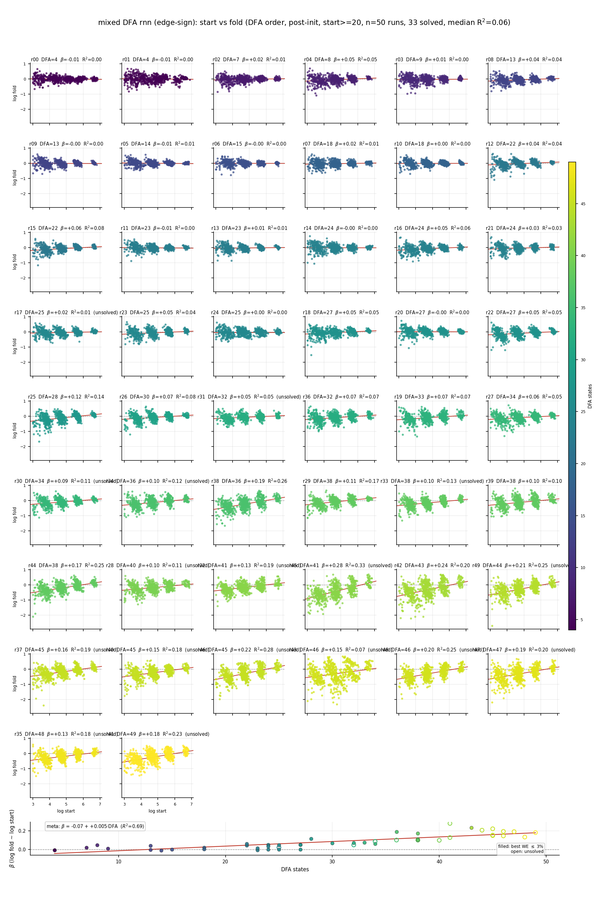
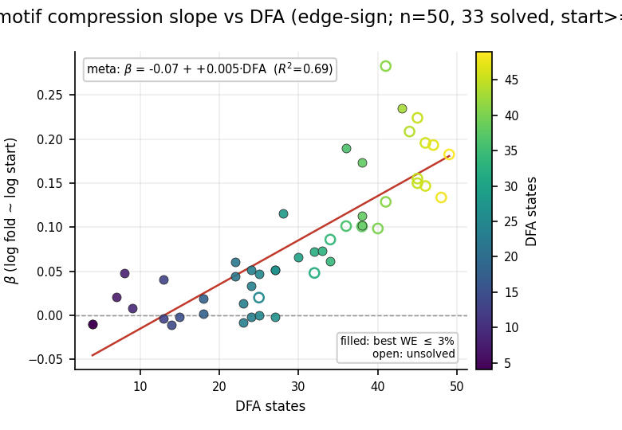

# 2026-08-22

## Session — unconstrained RNN motif fold analysis (branch off main)

Branch: `motif-analysis-unconstrained` (from `main`). Same over-learning motif pipeline as Dale, applied to **unsigned RNNs** (`model=rnn`, H=100) in `mixed_vocab_dfa_ns`.

### Questions
- Does “start count predicts fold” hold for unconstrained RNNs the way it does for Dale?
- Without Dale E/I units, how do we color motifs? Use **edge weight signs** on the thresholded digraph.
- Does β vs DFA still trend (and in which direction)?

### Method
- Census: Holland–Leinhardt connected triads on mean-|W| digraph.
- Coloring: each present edge tagged `+`/`−` from `sign(W_ij)` → keys like `T|01,12,20|++-`.
  - New: `compute_weight_edge_signed_hl_motif_counts` in `viz/weight_structure.py`.
- Same knobs as Dale board: skip iter 0, start ≥ 20, ≤8 snaps/run, seed 1, all 50 runs.
- CLI: `python scripts/r43_motif_figs.py --only all-runs-over-learning --rebuild-cache --model rnn --coloring edge_sign`

### Results
- **33/50** unconstrained runs hit ≤3% WE (vs Dale H=200: 26/50; Dale H=300: 34/50).
- Per-run start→fold fit is **weak** on average (median R² ≈ **0.06**), but β is systematically related to DFA size.
- Meta-regression: **β ≈ −0.07 + 0.005 · DFA** (R² ≈ **0.69**). corr(DFA, β) ≈ **+0.83**.
- **84% of runs have β > 0** — abundant edge-signed motifs tend to *grow* (or shrink less) relative to rare ones.
- Contrast with Dale (node E/I coloring): β became **more negative** with DFA (census compression / homogenization). Here the slope flips sign: larger DFAs amplify the start–fold dependence in the **positive** direction.





### Consequences
- Motif fold∼start is **not a Dale-only artifact**, but the **direction differs**: Dale compresses; unconstrained edge-sign census tends to reinforce abundant polarity patterns as tasks get harder.
- Edge-sign coloring is the right analog of Dale node coloring for unsigned nets (unit E/I is undefined; synapse polarity is).
- Open: does unsigned *topology-only* (no edge signs) still show a DFA–β trend? Would column-sign pseudo-E/I mimic Dale’s negative slope?

### Artifacts
- `experiments/comparisons/mixed_vocab_dfa_ns/trajectories/mixed_dfa_rnn_motif_fold_all_runs.json`
- `experiments/comparisons/mixed_vocab_dfa_ns/trajectories/mixed_dfa_rnn_motif_counts_raw_over_learning.png`
- `experiments/comparisons/mixed_vocab_dfa_ns/trajectories/mixed_dfa_rnn_motif_fold_beta_vs_dfa.png`

### Canonical command
```bash
python scripts/r43_motif_figs.py --only all-runs-over-learning --rebuild-cache --model rnn --coloring edge_sign
```
