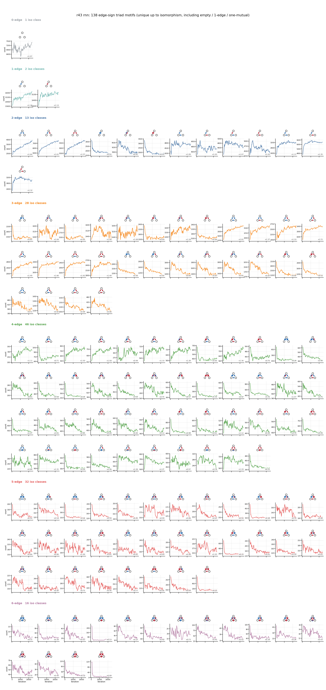
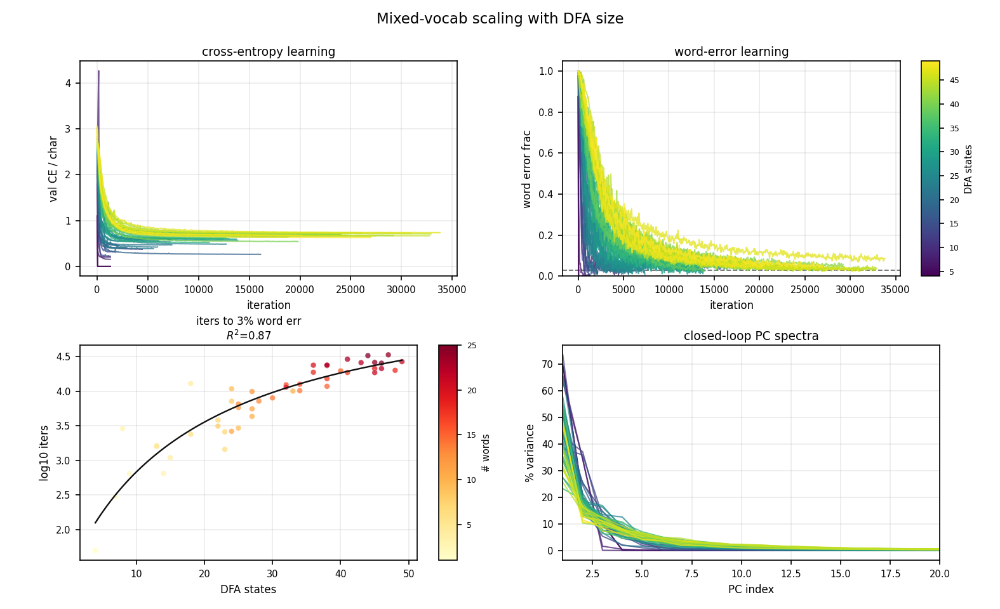
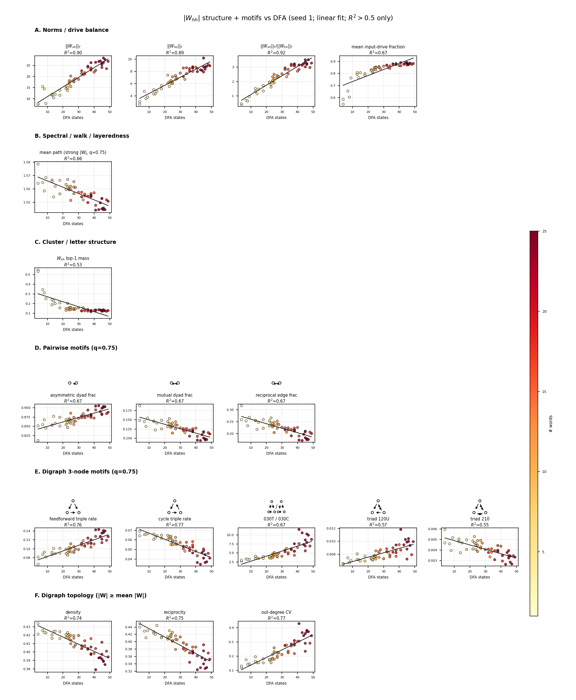
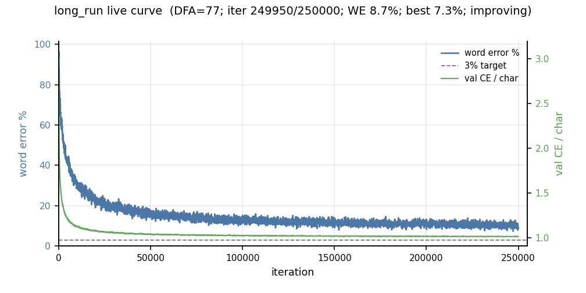
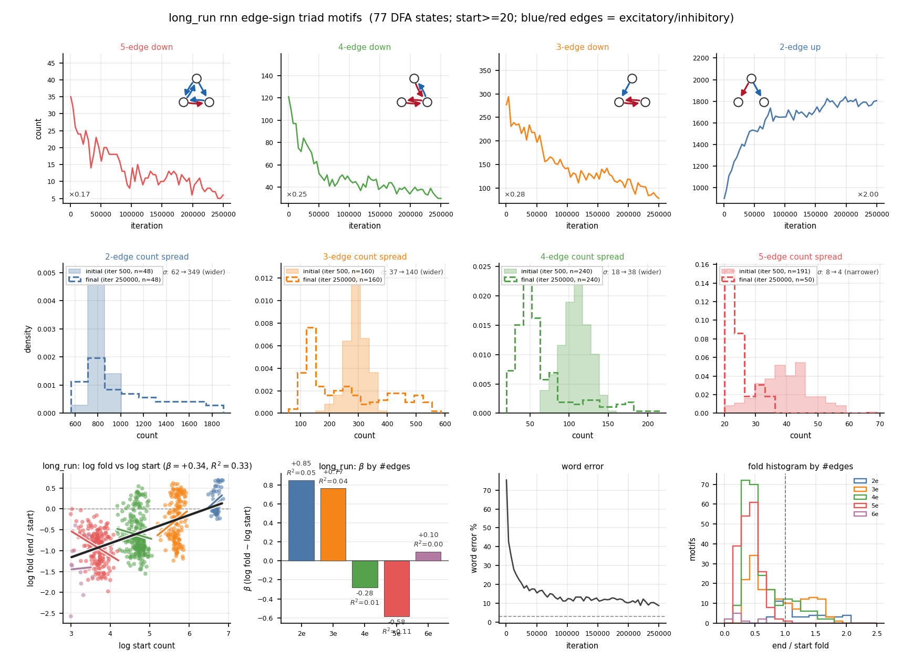

## Session — 138 edge-sign triad iso classes over learning

### Questions
- How many signed 3-node motifs exist up to isomorphism, with nothing skipped?
- Do all 138 count trajectories over learning (r43 unconstrained RNN) follow the same homogenization pattern?

### Experiments / controls
- Combinatorics: each of 6 possible arcs is absent / `+` / `−` → \(3^6=729\) labeled graphs; \(S_3\) quotient → **138** iso classes (incl. empty, 1-edge, one-mutual).
- Census: existing labeled edge-sign HL keys collapsed by node relabeling; sparse HL `003`/`012`/`102` filled from r43 learning snaps (`mode=mean` threshold).
- Single run r43, 53 post-init snaps, hidden size 100.

### Results
- Iso catalog: 0e 1, 1e 2, 2e 13, 3e 28, 4e 46, 5e 32, 6e 16.
- Median end/start fold shrinks with density: 0e ×1.07, 1e ×1.16, 2e ×1.09, 3e ×0.89, 4e ×0.72, 5e ×0.61, 6e ×0.40.
- Dense complete (6-edge) classes drop hardest (min ×0.09); empty / 1-edge slightly rise.



### Consequences
- The labeled 704-key census is the same 132 connected iso classes plus the 6 sparse ones; collapsing does not change the density-homogenization story.
- Still r43-only; all-runs iso trajectories not plotted.

### Artifacts
- [r43_rnn_motif_iso_counts_over_learning.png](../../experiments/comparisons/mixed_vocab_dfa_ns/motifs/r43_rnn_motif_iso_counts_over_learning.png)
- `experiments/comparisons/mixed_vocab_dfa_ns/motifs/r43_rnn_motif_iso_over_learning.json`

### Canonical commands
```
python scripts/r43_motif_figs.py --only r43-rnn-iso-over-learning
```

## Session — poster Fig 12 / Fig 16 y-axis layout

### Questions
- Fig 12 y-axis labels colliding with neighboring panels; Fig 16 missing y-axis labels.

### Experiments / controls
- Canonical plotters: `plot_mixed_dfa_scaling_overview`, `plot_mixed_dfa_weight_graph_metrics_paper`.
- Fig 12: wider gutters (`wspace=0.58`); DFA colorbar moved off the CE panel onto a stub right of the spectra panel.
- Fig 16: metric name as ylabel on every scatter; more column spacing.

### Results
- Poster Fig 12 (`scaling_overview.png`) no longer puts the DFA colorbar in the CE/WE gutter.
- Poster Fig 16 (`weight_graph_metrics_vs_dfa_paper.png`) has y-axis labels on all 12 panels.

### Artifacts
- 
- 
- Paper copies: [fig_mixed_scaling_overview.jpg](../figures/compare/fig_mixed_scaling_overview.jpg), [fig_weight_graph_motifs_vs_dfa.jpg](../figures/main/fig_weight_graph_motifs_vs_dfa.jpg)

### Canonical commands
```
python -c "from viz.compare.mixed_dfa_viz import plot_mixed_dfa_scaling_overview; plot_mixed_dfa_scaling_overview(recompute=False)"
python scripts/mixed_dfa_sweep.py weight-layeredness --replot-only
```
## Session -- long_run hard DFA (77 states), 250k steps, motif board

### Questions
- Does a long unconstrained H=100 run on a hard mixed-English vocab (~75-100 DFA states) keep improving, and what do edge-sign triad motifs do?

### Experiments / controls
- New comparison `long_run_ns`: full 80-word mixed English bank, minimized DFA=77, H=100, LR=0.04, 250k steps, stall off, seed 1, learning snaps every 500.
- Same motif board path as mixed-DFA single-run boards (`plot_single_run_motif_board`, standalone).

### Results
- Training finished 250k/250k. Confirmed best WE 8.42% at iter 234600 (did not hit 3%). Live evals: last 8.7%, noisy best 7.3%. Val CE settled ~1.01.
- Motif board: dense 5/4/3-edge demos compress (x0.17 / x0.25 / x0.28); 2-edge demo grows x2.00. Pooled log-fold vs log-start beta=+0.34 (R2=0.33); within-tier beta is + for 2-3 edges and - for 4-5 edges. Weight-graph edges 4193 -> 3588.





### Consequences
- Hard 77-state vocab with H=100 does not solve to 3% even in 250k steps; WE plateaus ~8-12%.
- Homogenization still shows up in dense-vs-sparse demos, even though the pooled slope is not the mixed-DFA negative-beta story.

### Artifacts
- [live_curve.png](../../experiments/comparisons/long_run_ns/learning_curves/live_curve.png)
- [long_run_rnn_motif_board.png](../../experiments/comparisons/long_run_ns/motifs/long_run_rnn_motif_board.png)

### Canonical commands
```
python scripts/long_run.py plan
python scripts/long_run.py train --device cpu
python scripts/long_run.py curve
python scripts/long_run.py motif-board
```